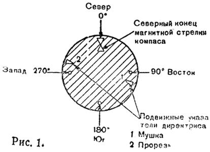
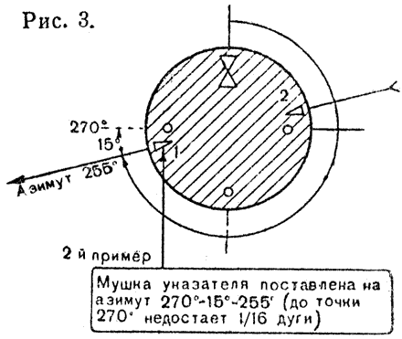
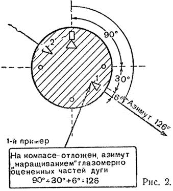

* * *

#  
---
  

**ДВИЖЕНИЕ ПО АЗИМУТУ НОЧЬЮ**

** **

**Майор  
Е. Натенадзе**

Маневр подразделений в условиях ограниченной видимости - ночью, в сильный
снегопад и в тумане - весьма часто зависит от того, насколько точно
выдерживается указанное направление.  
  
В учебниках по военной топографии данный вопрос освещен недостаточно, притом
разрозненно, а опыт войск еще не собран и не обобщен. В настоящей статье автор
ставит своей задачей рассказать о своей практике обучения курсантов движению
по азимуту ночью.  
  
Порядок и техника движения при помощи компаса ночью в основном те же, что и
днем. Особенности заключаются в том лишь, что деления лимба на компасе для
точного отложения ночью заданных азимутом различаются с трудом, местных
предметов и ориентиров для выдерживания требуемого направления часто не видно,
записей данных для движения (величины азимутов и количества пар шагов) также
почти не видно, что особенно неудобно при большом количестве изломов маршрута.  
Эти трудности могли бы быть в известной мере устранены, если в движении
пользоваться карманным фонарем. Но в боевой обстановке свет фонаря сводит на
нет основное преимущество ночного движения - скрытность, а следовательно, не
всегда может быть применен.  
  
Рассмотрим отдельные способы, посредством которых можно облегчить трудности
движения по азимуту в условиях темноты:

1\. Как в темноте найти на компасе нужный отсчет и направление движения по
азимуту. Для движения ночью лучше применять светящийся компас (компас
Адрианова), но в темноте и на его лимбе мы будем видеть лишь светящиеся точки
и фигуры, условно обозначающие страны света, северный конец стрелки и
директрису (рис. 1).

Если твердо помнить градусные величины основных стран света (север - 0°,
восток - 90°, юг - 180°, запад - 270°), найти их при таком компасе нетрудно:
достаточно лишь поворотом крышки компаса поставить директриссу "мушкой" в
точку, соответствующую данному азимуту на компасе. Мушку и прорезь при этом
различают на ощупь. Однако в большинстве случаев градусная величина азимута не
будет совпадать с градусами основных стран света. Тогда величина азимута
откладывается на компасе как сумма градусного значения ближайшей по ходу
часовой стрелки точки на компасе плюс величина части дуги следующей четверти
окружности, оцененная на глаз. Например, середина дуги - 45°, одна треть -
30°, одна шестая часть - 15° и т.д. Диаметр светящейся точки можно принять
равным 3° (рис. 2 и 3). Предварительной десятиминутной тренировкой в темноте
(с последующей проверкой при свете) можно добиться откладывания азимута с
точностью до 3°, что практически достаточно.

2\. Как выдержать необходимое направление в движении ночью. Заданное
направление в пути можно, в зависимости от обстановки, выдерживать при помощи
проверки ориентировки или по компасу, или по проектирующимся впереди (на
горизонте) дальним силуэтам местных предметов и светящихся наземных точек, или
же по замеченным ярким звездам. В последнем случае надо, однако, учитывать,
что звезды непрерывно перемещаются (по часовой стрелке) вокруг Полярной
звезды, являющейся как бы осью вращения небосвода, которую можно считать
практически недвижимой. Поэтому через 15-20 минут движения в направлении
избранной звезды необходимо вновь проверить, как выдерживается азимут, и в
случае заметного смещения с пути наметить новую звезду.  
  
В качестве вспомогательных ориентиров для сверки их с картой, по которой
заранее тщательно изучается маршрут, можно использовать различаемые в темноте
дороги, мосты, ручьи, опушки леса, отдельные здания и т.д.

   
  

3\. Как узнать в темноте данные при перемене направления на изломах линии
маршрута. При движении по азимуту ночью целесообразно назначать маршрут с
минимальным количеством поворотов, данные о которых (азимут и пары шагов)
можно запоминать самому или поручать счет бойцам. Можно эти данные и записать,
но крупно и четко, цифрами размером в 1,5-2 см (черным или красным карандашом
на белой бумаге). Как показывает практика, такая запись ночью (при пасмурном
небе) бывает различима.  
Я полагаю, что эти простые практические сведения могут пригодиться при
обучении рядовых, курсантов и сержантов движению в темноте с помощью компаса.

* * *

