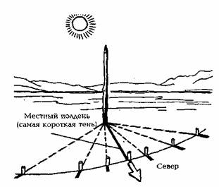
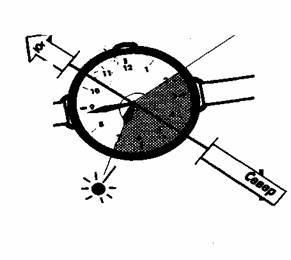
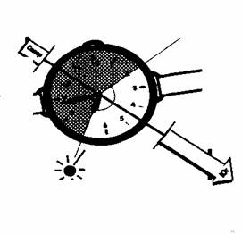
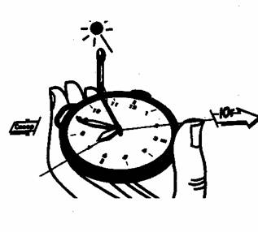

* * *

 **ОРИЕНТИРОВАНИЕ  
ПО СОЛНЦУ И ЗВЕЗДАМ  
**  
Самое высокое положение Солнца определяется по длине самой короткой тени, что
соответствует полудню, а ее направление в северном полушарии указывает на
север (рис. 2). Это соответствует действительности только между Северным
полюсом и северным тропиком.  
  
  
Рис. 2 Способ определения местного полудня и направления на север.  
Правило применимо в следующих случаях:  
а) когда Солнце находится в зените (тень в основании предмета);  
б) на экваторе, где полуденная тень полгода направлена на север (с 24 сентября
по 20 марта) и полгода на юг (с 21 марта по 23 сентября);  
в) в широтах между экватором и тропиками, где тень также меняет направление.  
В южном полушарии, наоборот, тень указывает на юг.  
С относительной точностью стороны горизонта можно определить по Солнцу с
помощью часов. Для этого, держа часы горизонтально, нужно повернуть их так,
чтобы часовая стрелка была направлена на Солнце. Минутная и секундные стрелки
в работе не участвуют и следовательно внимание на них не обращается.
Биссектриса угла между часовой стрелкой и направлением на цифру «2» на
циферблате покажет на юг. Следует помнить, что до полудня надо делить угол на
циферблате, который часовая стрелка должна пройти до «2» часов, а после
полудня — тот угол, который она прошла после 2 часов, т.е. до полудня юг будет
справа от солнца, а после полудня – слева (рис. 3,4).  
Этот способ ориентирования дает сравнительно правильные результаты в северных
и отчасти средних широтах, особенно зимой, менее точно — весной и осенью,
летом же ошибка в ориентировании может достигать 25°. В южных широтах, где
Солнце летом стоит высоко, точность ориентирования еще меньше, и пользоваться
этим способом не рекомендуется.  

  
  
Рис. 3 Определение направления по Солнцу и часам до полудня (время местное).  

  
  
Рис. 4. Определение направления по Солнцу и часам после полудня (время
местное).  
Более точен прием с часами и спичкой. Часы следует придать наклонное положение
под углом примерно 40—50° к горизонту, при этом часы надо держать большим и
указательным пальцами у цифр «3» и «9», цифрой «12» от себя (рис. 5).  
Найдя на циферблате середину дуги между часовой стрелкой и цифрой «2»,
перпендикулярно циферблату прикладывают спичку. Не изменяя положения часов,
поворачивайтесь вместе с ними по отношению к солнцу так, чтобы тень от спички
проходила через центр циферблата — в этот момент цифра «2» укажет направление
на юг.  

  
  
Рис. 5. Определение сторон света по часам с помощью спички.  
Очень важно помнить, что часы в этот момент должны показывать местное
(поясное) время. Необходимо учитывать, что, например, истинный полдень (по
принятому на территории бывшего СССР в целях экономии электроэнергии и
рациональной работы декретному времени) наступает лишь в 13 часов. Именно
поэтому на циферблате выбирается цифра «1», а не «12». Кроме того, надо
принимать во внимание проводимый в последнее время перевод стрелок на час
вперед или на час назад в зависимости от времени года (так называемое «летнее
время»). Таким образом, полдень летом может не сходиться с истинным поясным
уже на два часа. В этом случае биссектрису уже следует проводить между часовой
стрелкой и цифрой «2».  
**Следите, чтобы часы показывали истинное поясное время.**  
Ориентирование по часам и солнцу дает хорошие результаты в умеренных широтах,
особенно зимой, менее точно — весной и осенью. Летом, когда солнце высоко
стоит над горизонтом, ошибка может достигать 20 — 25°. В южных широтах
описанные способы лучше не применять.  

* * *

