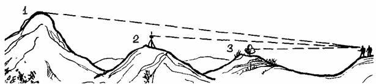
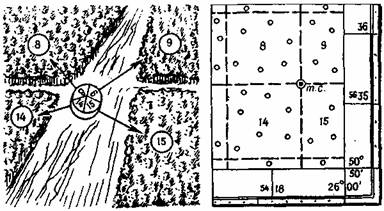

**ОСОБЕННОСТИ ОРИЕНТИРОВАНИЯ В РАЗЛИЧНЫХ УСЛОВИЯХ МЕСТНОСТИ И НОЧЬЮ**

**  
Общее ориентирование.**  
  
Общим ориентированием называют такое, при котором известны направление
движения, район местонахождения, расстояние до ближайших крупных ориентиров.
Например, известно, что группа находится в долине такой-то реки на северном
склоне хребта, восточнее населенного пункта в стольких-то километрах. Общим
ориентированием ограничиваются в тех случаях, когда нет нужды в детальном
изучении местности, точном определении точки стояния для определения пути к
какому-либо конкретному ориентиру.  
Детальное ориентирование. Это такое ориентирование, при котором точно
определяются положение точки стояния (местонахождения группы), направление
сторон горизонта и пути следования, опознаются окружающие географические
объекты и определяется их положение. Детальное ориентирование устанавливается
и сохраняется в ключевых точках маршрута, например, когда надо определить путь
к перевальной седловине, свернуть из основной долины в одну из боковых,
ведущую к нужной вершине, на развилке дорог выбрать именно ту, которая
приведет к цели пути.  
  
Непрерывное сохранение детальной ориентировки резко снижает скорость движения
группы, вызывает необходимость частых остановок и в большинстве случаев просто
нереально в условиях перехода, особенно на территории, контролируемой
противником. Поэтому целесообразно сохранять общую ориентировку, а к детальной
переходить но мере надобности, например, во время коротких перерывов в
процессе движения, привалов на обед и ночлег. Если переход от общего
ориентирования к детальному вызывает затруднения, это значит, что ориентировка
потеряна и ее нужно срочно восстановить. Золотым правилом должно стать: «Не
забывай про ориентировку — ее гораздо труднее восстанавливать, чем сохранять».  
  
Надежными ориентирами служат высокие, резко выделяющиеся на общем однообразном
фоне объекты: горные вершины, отдельные скалы, искусственные сооружения
башенного типа, такие, как вышки геодезических знаков, колокольни, трубы,
ретрансляторы и т. н.  
Однако ночью, в туману, в дождь или метель такие объекты теряют значение
ориентиров. В таких условиях удобнее определять местоположение по линейным
ориентирам, пересекающим .путь следования, таким, как ручьи, канавы, дороги,
которые нельзя пройти, не заметив. При оценке и выборе ориентиров всегда
следует учитывать условия, при которых ими придется пользоваться в пути.  
  
Ориентирование в горах имеет свои особенности. Оно значительно усложнено из-за
глубокой расчлененности горного рельефа и труднодоступной местности. Вершины,
выбранные в качестве ориентиров, резко меняют свои очертания, если смотреть на
них с разных сторон, а иногда вообще теряются из виду. Обзор местности с
высоких вершин очень велик, а в узких лощинах слишком ограничен. Сильная
пересеченность местности вынуждает часто менять направление движе­ния. В этих
условиях, чтобы уверенно управлять группой в пути, очень „важно хорошо изучить
рельеф и запомнить расположение основных долин, хребтов и выдающихся вершин.
Движение по намеченным ориентирам выдерживать трудно, так как они часто
теряются из виду. В таких случаях необходимо в створе с заданным ориентиром
наметить несколько вспомогательных, расположенных на разных высотах (рис. 30).  
  
  
Рис. 30. В горах в створе с основным ориентиром (1) выбираются вспомогательные
ориентиры (2, 3).  
  
Следует также учитывать, что в горах из-за большой прозрачности воздуха
расстояния представляются меньшими, чем в действительности. Иногда кажется,
что какая-нибудь вершина расположена в непосредственной близости, а на самом
деле расстояние до нее составляет несколько километров.  
Важнейшим условием правильного ориентирования в горах является умение читать
по карте рельеф. При подготовке к переходу следует изучить все подъемы и
спуски, определить их протяженность и крутизну.  
В качестве ориентиров вдоль намеченного маршрута выбирают выделяющиеся
вершины, седловины, обрывы, скалы, осыпи и другие подробности рельефа, а также
все местные предметы: в горах они встречаются довольно редко и поэтому хорошо
опознаются. Горная местность позволяет наметить вспомогательный ориентир,
видимый со многих точек маршрута. Такой ориентир обычно выбирают
непосредственно на местности в начале движения. Им могут быть выделяющаяся
вершина, заметный выступ хребта, а иногда и населенный пункт. Пользуясь в пути
вспомогательным ориентиром, можно всегда проверить правильность общего
направления движения.  
Горные реки и ручьи, протекающие по долинам, являются хорошими линейными
ориентирами. При движении по долинам в качестве ориентиров могут служить также
распадки (места слияния двух долин), утесы, крутые склоны, узкие сужения
долины и различные местные предметы.  
  
В распадках часто бывает трудно определить дальнейшее направление движения,
так как расходящиеся под острым углом долины нередко сходны между собой по
форме и ширине. Чтобы избежать ошибки в выдерживании маршрута, следует вначале
определить по карте азимуты направлений долин, а затем на местности
воспользоваться компасом.  
При ориентировании в горах необходимо знать природные признаки, по которым
можно определить стороны горизонта.  
Ориентирование в лесу затруднено из-за узости обзора. При переходе в лесу
иногда просто невозможно выбрать ориентиры, которые были бы видны на
значительном расстоянии. Маршруты в лесной местности иногда могут проходить по
грунтовым дорогам и просекам. Такие дороги обычно мало наезжены и нередко
плохо заметны, причем некоторые из них могут быть не показаны на карте, так
как являются временными.  
При изучении карты и данных для перехода целесообразно определить и выписать
азимуты каждого участка пути. Эти данные позволят проверять по компасу
направление движения в любом месте маршрута.  
  
Если в пути встретится развилка дорог, не показанная на карте, то с помощью
компаса по значению выписанного азимута легко установить, какая из дорог
соответствует изображенной на карте. Особенно внимательно следует изучить
рельеф и гидрографическую сеть. Знание взаимного расположения крупных лощин,
рек и ручьев окажет неоценимую услугу при потере ориентировки.  
При движении по просекам можно по карте легко определить свое местонахождение.
Для этого достаточно остановиться на пересечении просек, отыскать квартальный
столб и прочитать на нем подписи номеров лесных кварталов. По цифрам,
обозначающим номе­ра кварталов, нетрудно найти на карте положение самих
кварталов, а также место их соединения, т. е. точку вашего стояния (рис. 31).  
  
Рис. 31. Определение точки стояния на карте по подписям на квартальных
столбах.  
Но это в том случае, если карта содержит такие сведения.  
При выдерживании направления пути с помощью компаса им приходится пользоваться
довольно часто, так как в лесу трудно, а порой и невозможно выбрать
вспомогательные ориентиры. В безоблачную погоду ориентирами могут служить
солнце днем или луна ночью. В солнечную погоду направление выдерживают по
теням от деревьев. Нужно только вначале заметить угол между направлением
движения и направлением теней и в пути следить, чтобы этот угол все время
выдерживался. Через каждые 20—30 минут направление пути уточняют с помощью
компаса, так как тени перемещаются за один час примерно на 15°.  
Пройденные расстояния учитываются счетом пар шагов или по времени движения.
При этом следует иметь в виду, что скорость движения в лесу колеблется в
зависимости от его густоты и характера местности.  
Ориентирование в пустынно-степной местности. Пустынно-степная местность
однообразна, местные предметы встречаются редко, рельеф преимущественно
равнинный или мелко холмистый, формы его маловыразительны.  
Дорог в пустынно-степных районах очень мало, и это главным образом грунтовые
дороги, тропы и караванные пути. Они обычно слабо наезжены и малозаметны,
часто теряются среди растительности, и только незначительные углубления
грунта, а в ряде мест и более зеленая растительность вдоль этих углублений,
которая выделяется на общем фоне, указывают на их местоположение.  
  
Основные ориентиры пустынно-степных районов — курганы, такыры, колодцы, русла
высохших рек, оазисы, развалины и различные сооружения, связанные с
религиозными культами. В целом ориентиров в этих районах мало, но при
благоприятных условиях видимости многие из них просматриваются издалека.  
При изучении местности по карте необходимо выявить все отдаленные, хотя и
небольшие высоты и курганы, так как по ним с помощью компасной засечки можно
определить точку стояния. Для этого целесообразно подклеить к карте маршрута
соседние листы.  
Особое внимание следует обратить на линейные ориентиры: дороги и тропы, сухие
русла рек, границы песков и т. п. Они используются не только для выдерживания
маршрута, но и для восстановления ориентировки. Допустим, мы сбились с
правильного пути и знаем только то, что находимся где-то в районе юго-
восточнее сухого русла реки. В этом случае направляемся на северо-запад, и на
нашем пути встретится сухое русло. Далее, двигаясь вдоль русла в ту или иную
сторону, мы всегда обнаружим или характерный изгиб, или какой-либо другой
ориентир, по которому определим свое местонахождение.  
По равнинам степей и пустынь можно двигаться вне дорог в любом направлении, но
отсутствие ярко выраженных ориентиров затрудняет выдерживание направлений. В
этих условиях требуется умение двигаться точно по азимуту и ориентироваться по
малозаметным ориентирам.  
Для выдерживания нужного направления можно воспользоваться небесными светилами
и луной. В отдельных случаях направление можно выдерживать по идущим сзади
машинам или по следу своей машины, если движение прямолинейное, а также по
расположению дюн, барханов и ряби на песке, которое зависит от направления
господствующего ветра и практически постоянно для данного района.  
  
Ориентирование ночью наиболее сложно. Многие предметы, которые днем легко
опознаются, ночью становятся трудноразличимыми, внешний вид и очертания их
подчас резко меняются. Расстояния, проходимые ночью, кажутся больше, чем те же
расстояния, проходимые днем. Все эти особенности существенно затрудняют
ориентирование.  
При планировании ночного перехода предпочтение следует отдавать маршруту с
благоприятными условиями ориентирования, хотя он может иметь и большую
протяженность. Ночью сравнительно легко выдерживать маршрут при движении в
районе дорог, обсаженных деревьями, линий электропередач, лесополос и других
линейных ориентиров, хорошо заметных и в темное время суток.  
В качестве ориентиров выбирают и используют предметы, которые могут выделяться
на фоне ночного неба: заводские трубы, башни, рощи, отдельные вершины и т. п.
Ориентирами ночью служат также реки, озера и пру­ды, зеркальная поверхность
которых хорошо заметна на темном фоне окружающей местности. Наиболее надежные
ориентиры — это линейные объекты, пересекающие путь: реки и ручьи, линии
электропередач и т. п. На участках пути вне дорог и троп, вдоль которых нет
линейных ориентиров, хорошо видимых ночью, необходимо определять азимуты и
четко их выписывать.  
Чтобы уверенно двигаться ночью по наме­ченному маршруту, нужно предварительно
заучить по карте и запомнить весь путь со всеми намеченными ориентирами. При
наличии времени целесообразно изучить не только маршрут, но и всю местность
вдоль маршрута на 1—2 километра в стороны от него. Изучение карты можно
считать законченным, если вы сумеете по памяти составить схему участка. В этом
случае выдерживать маршрут значительно легче, и даже при потере намеченного
пути нетрудно будет определить свое местонахождение и восстановить
ориентировку.  
  
Карту в пути рекомендуется освещать карманным фонариком с синим фильтром. При
таком освещении можно работать с картой и вести наблюдение за местностью.  
Действия в пути при выдерживании маршрута ночью аналогичны действиям в светлое
время суток. Предварительное запоминание местности, расположенной вдоль
маршрута, даст возможность знать свое местонахождение в любой момент движения,
не обращаясь все время к карте.  

* * *

