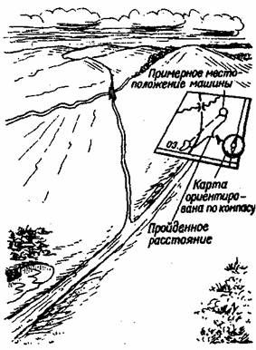

ВОССТАНОВЛЕНИЕ ПОТЕРЯННОЙ ОРИЕНТИРОВКИ  
  
Ориентировка считается потерянной, когда нет возможности отождествить
местность и карту, найти на карте наблюдаемые на местности ориентиры и
определить свою точку стояния. Причинами потери ориентировки могут быть
устаревшая или неполная карта, неисправность компаса, небрежное, с ошибками
выполненное ориентирование, но чаще всего — движение наугад, не глядя ни на
карту, ни на компас.  
  
При потере ориентировки следует остановиться и постараться определить по карте
свое местонахождение. Делают это так. Ориентируют карту и от условного знака
последнего ориентира проводят линию, соответствующую направлению последнего
участка дороги. Отложив по этой линии расстояние, пройденное от последнего
ориентира, получим примерное положение точки стояния. Рассмотрим это на
примере.  
  
Допустим, наш маршрут проходит по грунтовой дороге правее озера (рис. 32).
Миновав очередной ориентир (озеро), мы не заметили развилку или не обратили на
нее внимания и пошли не по левой, а по правой дороге, которой на карте нет.
Так мы сбились с намеченного маршрута, в чем убедились, не обнаружив на
местности очередного ориентира — моста. В том месте, где по расчетам должен
быть мост, останавливаемся и ориентируем карту с помощью компаса. На
ориентированной карте проведем от условного знака озера прямую линию,
направленную вдоль того участка дороги, где мы остановились.  
  
Отложив по этой линии расстояние, пройденное от озера, получим точку,
указывающую примерное местонахождение группы.

  
Рис. 32. Восстановление потерянной ориентировки.  
  
Все построения на карте делают простейшим способом: компас прикладывают к
ориентиру и по его лимбу откладывают требуемый угол, затем в этом направлении
на глаз откладывают нужное расстояние.  
  
После того, как определено вероятное местонахождение, следует изучить
окружающие предметы, опознать их на карте и уточнить свое местонахождение.
Если это удастся, остается наметить выход на маршрут и продолжить движение.
Если сориентироваться не удастся, то целесообразно вернуться по своим следам к
последнему, хорошо опознанному ориентиру и отсюда, проверив направление
дальнейшего пути, продолжать движение по маршруту.  
В некоторых случаях, когда имеются линейные ориентиры (железные дороги, шоссе,
линии электропередач, реки и т. п.), проходящие перпендикулярно общему
направлению маршрута, движение можно продолжить в прежнем направлении до
выхода к линейному ориентиру, легко опознаваемому на карте. Здесь следует
уточнить свое местонахождение и наметить выход на маршрут или непосредственно
в нужный район.  
  
Есть и другой вариант выхода из такой ситуации. Обнаружив потерю ориентировки,
нужно остановиться и в зависимости от обстановки (времени суток, погоды,
сложности участка, удаленности противника) принять оптимальное решение о
дальнейших действиях. В большинстве случаев рекомендуется двигаться дальше в
направлении движения, внимательно наблюдая встречающиеся ориентиры и проводя
маршрутную съемку или измерения для последующей прокладки пути. Дойдя до места
большого привала (ночевки), следует приступить к непосредственным действиям по
восстановлению ориентировки.  
Прежде всего следует вспомнить, когда и где последний раз имелась детальная
ориентировка. Эта точка наносится на карту (точка А). От нее в известном или
наиболее ве­роятном направлении движения откладывается расстояние,
подсчитанное по ходовому времени и средней вероятной в этих условиях скорости
движения. Получим точку Б. Из нее радиусом, равным половине расстояния АБ,
проводится окружность.  
  
При отсутствии циркуля это можно сделать с помощью булавки, нитки и карандаша.
Район вероятного местонахождения группы находится в пределах окружности.  
Затем нужно вспомнить и проанализировать весь последующий путь (время,
направление движения, виденные ориентиры). После этого сделать прокладку пути
последнего участка в масштабе карты. Внимательным изучением карты в районе
вероятного местонахождения, ограниченного окружностью, нужно попытаться найти
версию своего пути и точки стояния. Иногда это удается сразу, иногда нет. Чаще
всего появляются две или несколько версий местоположения группы (сколько людей
— столько мнений). Если есть возможность проверить их на местности до­статочно
быстро, то это надо сделать.  
  
При восстановлении потерянной ориентировки надо анализировать всю имеющуюся
информацию, проверять все версии и привязки, а не бросаться на первую
попавшуюся. Особенно тщательно следует ориентироваться, начав движение после
потери ориентировки, ставя под сомнение и анализируя даже достоверную
информацию.  
Но вот вы вышли на дорогу — в какой стороне населенный пункт? Внимательно
осматривайтесь, пройдя по дороге 300—500 метров в любую сторону. Свежие следы
утром ведут от жилья, а вечером — наоборот. Клочки сена на придорожных кустах
покажут: в какую сторону его везли — там и деревня. На развилках проселочной
дороги, соединяющей крупные деревни, с полевой всегда видно, в какую сторону
ехал с поля в деревню колесный трактор. По мере приближения к деревне дорога
становится более наезженной. Спиленные деревья хлыстами тащили трактором к
деревне и т. д. Внимательно изучая следы на местности, можно получить много
информации. Все это время будьте бдительны — местность может наблюдаться
противником.  
  
  
Используемая литература:  
Военная топография. – М.: Воениздат, 1980;  
Драчев С.П. Туризм и здоровье. – М.: «Знание», 1984;  
Ильин А.А. Энциклопедия выживания. – М.: «Эксмо», 2005;  
Кудряшов Б.Г. Энциклопедия выживания. - Краснодар, 1999;  
Конюхов Ф.Ф. И увидел я новое небо и новую землю. – М.: «Армада», 1999»  
Морской энциклопедический справочник. В 2-х т. Т 1,2. – Л.: «Судостроение»,
1987;  
Чеурин Г.С. Самоспасение без снаряжения. – М.: «Русский журнал», 2000;  
Штюрмер Ю.А. Краткий справочник туриста. – М.: Профиздат, 1985;  
При подготовке использовался материал МЧС России, отдельные статьи по
безопасности жизнедеятельности, ориентированию, воспоминания инструкторов и
путешественников.  

* * *

