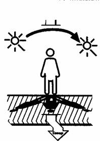

* * *

       Безоблачной ночью стороны горизонта легче всего определить по Полярной
звезде, всегда указывающей направление на север с точностью до 1°. Чтобы найти
на небосклоне эту звезду, находящуюся в созвездии Малой Медведицы, надо
отыскать созвездие Большой Медведицы, которое представляется в виде огромного,
хорошо заметного ковша из семи ярких, далеко отстоящих друг от друга звезд.
Если через две крайние звезды ковша провести воображаемую прямую, а расстояние
между ними отложить по этой линии пять раз, то на конце последнего отрезка
будет видна неяркая звезда — это и есть Полярная;— первая звезда ручки ковша
Малой Медведицы (рис. 6.1).

  
Рис. 6.1. Определение направления на Север по созвездию Малой Медведицы.  
  
  
В ситуации, когда созвездие Большая Медведица закрыто облачностью или
расположено слишком низко на небе, отыскать Полярную звезду может помочь
созвездие Кассиопея. Оно расположено почти всегда против созвездия Большая
Медведица и так же, как и оно, вращается вокруг Полярной звезды. Созвездие
Кассиопея состоит из пяти ярких звезд, напоминающих сильно сплюснутую букву
«М». Полярная звезда расположена прямо против центральной звезды созвездия
примерно на том же расстоянии, что и от Большой Медведицы (рис. 6.2).  

  
Рис. 6.2. Определение направления на Север по созвездию Кассиопеи  
  
Некоторое представление о сторонах света может дать движение звезд по
небосклону. Для того чтобы определить его более точно, следует изготовить
простейшее визирное приспособление из двух вбитых в грунт на некотором
расстоянии друг от друга кольев. На вершины двух кольев следует «посадить»
хорошо различимую звезду и заметить, в какую от визирной линии сторону она
сместится через несколько минут. Если направо — то вы смотрите приблизительно
на юг. Налево — значит, ваш взгляд направлен на север. Если поднимается вверх
— визир нацелен на восток. Опускается — на запад. Еще раз повторю, что данным
способом стороны света определяются очень приблизительно (рис. 7).  

  
Рис. 7. Определение направления по движению звезд на небосводе  
  
Подсказать направление на север может Млечный Путь — густая россыпь мелких
звезд, пересекающая небо широкой полосой и ориентированная в линии север — юг.
Но этот способ грешит приблизительностью.  
По солнцу. Днем поможет сориентироваться солнце. Если в местный полдень встать
спиной к солнцу, то тень укажет на север, соответственно юг будет сзади,
восток — по правую руку, а запад — по левую. Иначе говоря, самая короткая тень
от предмета указывает на север, и, одновременно, самая короткая тень
«отбивает» полдень (рис. 8).  

  
Рис. 8. Ориентирование по местному полдню.  
  
По тени. Чтобы точно определить полуденную тень, надо на ровной площадке под
углом в 45 — 50° вбить в землю полутораметровую палку. К ее вершине привязать
веревку, утяжеленную с нижнего конца камнем-отвесом. Под отвесом забить
колышек (рис. 9, точка А). За 30 — 50 мин до наступления местного полудня
(запас времени берется на случай неточного хода часов) отмечается конец тени,
отбрасываемой палкой (точка Б). С помощью веревочного циркуля, прикрепленного
одним концом к колышку (точке Л), от точки Б проводится полукруг. После
полудня конец тени от палки вновь неизбежно коснется линии полукруга (точка
В). Полученную дугу Б В надо разделить пополам, чтобы получить точку Г. Линия
АГ и будет являться полуденной тенью и указывать на север.  

  
Рис 9. Определение севера по тени  
  
  
Существует более простой, но менее точный способ определения сторон света
(рис. 10).На плоском участке местности надо вбить в землю метровый колышек и
отметить конец тени А. Через 15-20 мин сделать вторую отметку конца тени Б.
Полученная линия АБ будет расположена в направлении восток — запад. При этом
точка первой тени будет показывать западное направление, а второй — восточное.
Линия, проведенная от основания палки под прямым углом к линии восток — запад,
укажет на север. Данный способ наиболее точен в южных районах страны в летний
и зимний периоды, менее точен весной и осенью и совершенно непригоден в дни
солнцестояния.  

  
Рис 10. Второй способ определение севера по тени  
  
  
Кроме того, полезно знать, что в средних широтах в любое время года в
определенный час солнце может довольно точно указать на одну из сторон света.
В чем можно убедиться, обратившись к соответствующей таблице (таблица № 1).
Опять-таки надо помнить, что часы должны показывать местное (поясное) время.  
Таблица 1  

СТОРОНЫ ГОРИЗОНТА  | ВЕСНА  | ЛЕТО  | ОСЕНЬ  | ЗИМА  
---|---|---|---|---
На востоке  | 7 часов  | 5 часов  | 7 часов  | 9 часов  
На юго - востоке  | 10 часов  | 9 часов  | 10 часов  | 11 часов  
На юго - западе  | 16 часов  | 17 часов  | 16 часов  | 15 часов  
На западе  | 19 часов  |  21 часов  | 19 часов  |  19 часов  

  

* * *

