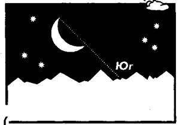
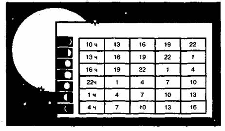

* * *

       **ОРИЕНТИРОВАНИЕ ПО ЛУНЕ  
**  
В ночной период времени помогает сориентироваться луна. Полная луна занимает
наиболее высокое положение над горизонтом, когда находится на юге. Иначе
говоря, самая короткая полуночная тень при полной луне указывает на север. В
таблице 2 приведена зависимость времени наблюдения фаз луны и сторон света.  
При слабой облачности, когда Полярная звезда не видна, но хорошо различима
Луна, стороны горизонта можно определить по ней, но точность определения будет
меньшей. Для приближенного ориентирования можно считать, что Луна находится в
следующих фазах (табл. 2).  
Таблица 2  

**Фаза Луны** | **19 часов** | **1 час** | **7 часов** 
---|---|---|---
**Первая    четверть (видна правая половина диска Луны)** | на юге | на западе | — 
**Новолуние** | на востоке | на юге | на западе 
**Последняя четверть (видна левая полови­на диска Луны)** | — | на востоке | на юге 
  
  
Так как ориентироваться приходится и в другие периоды времени, то направление
сторон горизонта можно определить по Луне и часам. При полнолунии стороны
горизонта можно определить так же, как по Солнцу и часам, причем Луна
принимается за Солнце. При других фазах Луны необходимо ввести поправку в
отсчет времени по часам.  
Делается это так. Устанавливают, прибывает Луна или убывает; оценивают на
глаз, сколько шестых долей радиуса Луны составляет освещенная часть ее диска.
Если Луна на ущербе, то к показанию времени на часах прибавляют такое
количество часов, сколько шестых долей радиуса составляет освещенная часть
диска. Если Луна прибывает, то из показания времени это число вычитается.
Часы, показывающие время с учетом поправки, направляются в сторону Луны. При
этом на Луну надо направлять не часовую стрелку, а то деление на циферблате
часов, которое соответствует вычисленному часу. Угол между этим направлением и
цифрой 1 на циферблате делится пополам. Это будет примерным направлением на
юг.  
Пример. Освещена левая часть Луны:  
а) Луна убывает, следовательно, значение поправки прибавляем к показанию
времени на часах;  
б) освещенная часть диска составляет 3/6 радиуса Луны, значит, поправка — 3
часа;  
в) время 20 часов + 3 часа поправка =23 часа;  
г) повернуть часы цифрой Ив сторону Луны и угол между цифрами 11 и 1 разделить
пополам. Биссектриса угла укажет направление на юг.  
Существует еще один упрощенный способ ориентирования по луне, находящейся в
первой или последней своей четверти (то есть когда видна лишь одна четвертая
часть диска.) В этом случае надо мысленно соединить концы «рожек» месяца
прямой линией и продолжить ее вплоть до пересечения с горизонтом. В Северном
полушарии эта точка будет указывать приблизительно на юг. В южном —
соответственно на север (рис. 11).

  
  
Рис. 11. Приблизительное определение сторон света по месяцу.  
В приполярных районах летом северная сторона неба наиболее светлая, южная
самая темная.  
По луне. Самая короткая полуночная тень при полной луне указывает на север.  
В таблице 3 приведена зависимость времени наблюдения фаз луны и сторон света.  
Таблица 3

  
  

* * *

