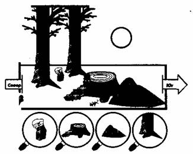
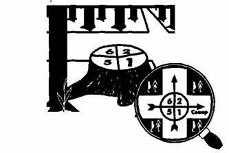

* * *

      **                                                                      **

**                                                                           ОПРЕДЕЛЕНИЕ СТОРОН ГОРИЗОНТА ПО РАСТЕНИЯМ И ЖИВОТНЫМ**

**  
**  
По местным приметам. При невозможности ориентирования по солнцу и звездам,
например, из-за сильной облачности, можно попытаться определить направление на
север по местным приметам. Строго говоря, это тоже астрономические, только как
бы законсервированные во времени способы ориентирования. Растения чутко
реагируют на интенсивность тепла, света, поэтому на освещенных солнцем
пространствах развиваются одни формы растительности, в тени -другие. И даже
одни и те же растения существенно отличаются друг от друга в зависимости от
того, где они растут — в тени или на солнце. Это их свойство и позволяет
заблудившемуся человеку ориентироваться в пространстве. Правда, растительные
«компасы» грешат большей приблизительностью, чем астрономические способы
ориентирования, и поэтому использовать их допустимо лишь тогда, когда
исчерпаны все другие возможности. Искать -«компасные»- приметы нужно только на
отдельно стоящих растениях и предметах.  
В густолесье, в ущельях, оврагах и других складках и перегибах рельефа, в
буреломе любые признаки смазаны, выражены нечетко, грешат приблизительностью.  
Наиболее ценную, с точки зрения аварийного ориентирования, информацию дают
отдельно стоящие деревья, пни, камни, растения и пр., расположенные на
открытых,  
ровных площадках — посреди больших полян, на опушках, лугах, так как там они
меньше подвержены воздействию местного микроклимата.  
Достаточно серьезным средством ориентирования могут служить деревья. Нередко с
северной стороны деревьев кора бывает грубее, темнее, с большим количеством
трещин. С южной — эластичней, суше, имеет более светлый оттенок. Особенно это
заметно на стволах таких широко распространенных пород, как береза, сосна,
лиственница, осина. Например, у березы со стороны, обращенной к югу, кора
мягче, чище, белее. У деревьев хвойных пород северная сторона ствола более
темная. В сырую погоду на деревьях хвойных пород, особенно это заметно у
сосны, в результате намокания коры образуется темная мокрая полоса. На
обращенной к северу стороне ствола она сохраняется дольше и поднимается выше,
так как туда почти не попадают солнечные лучи. Из-за того же эффекта
освещенности у сосны вторичная, бурая, потрескавшаяся кора на северной стороне
поднимается выше по стволу.  
Кроме того, у деревьев хвойных пород с южной стороны, сильнее прогреваемой
солнцем, натеки смолы гораздо обильнее (зачастую в форме многослойных натеков
и сосулек), чем с северной, где может быть лишь несколько смоляных капель. Та
же смола южной стороны дольше сохраняет светло-янтарный цвет.  
У сосны, у комля, ближе к корням, нередко обильно нарастает мох, лишайники.
Мох любит сырость, тень, норовит спрятаться от прямых солнечных лучей за
стволом и, значит, указывает на север. Точно так же мох располагается на
отдельных камнях, пнях, на скалах, на стенах старых деревянных и каменных
строений. Из лиственных деревьев мхом и лишайниками больше всего обрастают
осины и тополя. В случаях, когда ствол дерева покрыт разросшимся лишайником
вкруговую, надо ощупать его рукой. С северной стороны лишайник более влажный,
плотный, его больше. Засохшие деревья, пни, упавшие на землю стволы в большей
степени гниют с северной стороны (рис.12).  

  
  
Рис. 12. Определение сторон горизонта по местным приметам.  
Растительному и животному миру свойственны некоторые особенности, которые
можно использовать для определения сторон горизонта. Однако ориентирование по
растениям и животным менее надежно, чем простейшие астрономические приемы,
поэтому пользоваться ими можно только в крайних случаях, например, в пасмурную
погоду, когда не видно ни Солнца, ни звезд.  
Мхи и лишайники на коре деревьев сосредоточены преимущественно на северной
стороне. Сравнивая несколько деревьев, можно по этому признаку довольно точно
определить линию север — юг. Стремление мхов и лишайников развиваться в тени
позволяет использовать для ориентировки не только деревья, но и старые
деревянные строения, большие камни, скалы и т. п. На всех этих предметах мхи и
лишайники растут преимущественно с северной стороны.  
Другим неплохим ориентиром может служить кора деревьев, которая обычно с
северной стороны бывает грубее и темнее, чем с южной. Особенно это хорошо
заметно на березе. Но этим признаком можно пользоваться, наблюдая окраску коры
не одного дерева, а нескольких.  
После дождя .стволы сосен обычно чернеют с севера. Это вызвано тем, что на
коре сосны развита тонкая вторичная корка, которая образуется раньше на
теневой стороне ствола и заходит по ней выше, чем по южной. Корка во время
дождя набухает и темнеет.  
Если нет дождя, а стоит жаркая погода, то сосны и ели и в этом случае могут
служить ориентиром. Надо только внимательно присмотреться, с какой стороны
ствола выделяется больше смолы. Эта сторона всегда будет южной.  
Следует обращать внимание и на траву, которая весной на северных окраинах
полян более густая, чем на южных. Если взять отдельно стоящие пни, деревья,
большие камни, то здесь, наоборот, трава растет гуще с юга от них, а с севера
дольше сохраняется свежей в жаркое время года.  
Изучение повадок животных нередко дает интересный материал для ориентирования,
хотя при этом требуется еще более осторожный подход, чем при ориентировании по
растениям. Вот некоторые сведения об особенностях поведения животных.  
Муравьи устраивают свои жилища почти всегда к югу от ближайших деревьев, пней,
кустов. Южная сторона муравейника более пологая, чем северная.  
Степные пчелы строят свои жилища из очень прочного материала. Их гнезда
помещаются на камнях или на стенах, обращенных всегда к югу, и похожи на комки
грязи, отброшенные колесами повозок или лошадиными копытами.  
Трехпалые чайки, или моевки, гнездятся по скалам многочисленными стаями,
причем их гнезда всегда расположены на западных и северо-западных берегах
островов.  
Весной травянистый покров более развит и густ на северных окраинах полян,
лучше прогреваемых солнцем. В жаркий период лета наоборот: с северной стороны
полян трава выгорает, жухнет, а с южной, затененной, бурно растет. У отдельно
стоящих деревьев, пней, больших камней, строений трава растет гуще с южной
стороны. В жаркий день трава с северной стороны от предмета (камня, дерева и
пр.) дольше сохраняется свежей, влажной, иногда с каплями росы. И, напротив, с
южной стороны выпавшая роса подсыхает быстрее. В сильную жару почва с южной
стороны от предмета более сухая, трава вялая. А если жара стоит несколько дней
подряд, то с южной стороны трава высыхает и становится менее густой, сочной,
чем с северной. И грибы в сухую погоду чаще встречаются с северной стороны от
деревьев, кустов, пней.  
На северных склонах выпавшая утром роса сохраняется дольше. Ягоды на северных
склонах холмов поспевают позже, так как им достается меньше тепла и света.
Даже если внимательно рассмотреть отдельную ягоду, можно заметить такую
закономерность — сторона ягоды, обращенная к югу, нередко более красная,
спелая. Но если на ягодах этот признак бывает выражен слабо, и поэтому им надо
пользоваться осторожно, то на плодах он просматривается в большей степени.
Например, многие плоды приобретают окраску зрелости — краснеют или желтеют
раньше на ветках, обращенных к югу. На цветущих кустарниках с южной стороны
цветов больше, и распускаются они зачастую раньше, чем с северной.  
Чутко реагируют на магнитные поля некоторые животные и насекомые. К примеру,
мура-  
вейники с северной стороны, как правило, бывают защищены стволом дерева,
кустом, камнем, пнем. Южная сторона муравейника бывает более пологая, чем
северная, так как за счет такой конфигурации он получает большее количество
тепла и света. Но безоговорочно доверять муравьиному «компасу» не стоит, так
как иногда расположение и внешний вид муравейников зависят от особенностей
местного климата и рельефа. Суслики строят норки чаще всего к югу от камня или
дерева. Весной стаи перелетных птиц летят на север, осенью — на юг. Степные
пчелы строят свои жилища, напоминающие комки грязи, отброшенные колесами
транспорта или лошадиными копытами, на камнях или стенах, обращенных всегда к
югу.  
Помочь сориентироваться могут лесные просеки. В больших лесных массивах обычно
просеки ориентируются в направлении север — юг и запад — восток. Нумерация
кварталов лесных массивов в бывшем СССР идет с запада на восток и далее на юг.
Поэтому ребро между двумя наименьшими цифрами обычно указывает на север. Но
этот способ требует многократного подтверждения, так как иногда квартальные
столбы устанавливаются небрежно или случайно сдвигаются (рис. 13).  
Рис. 13. Определение сторон горизонта по квартальным столбам.  

* * *

