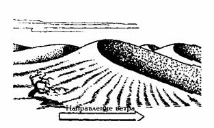
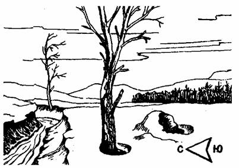
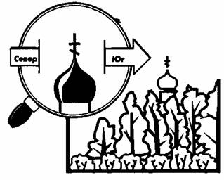
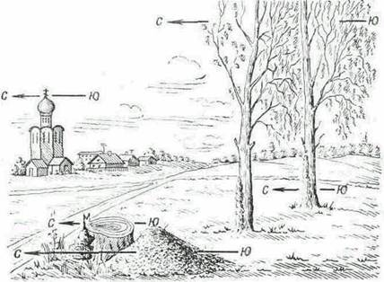
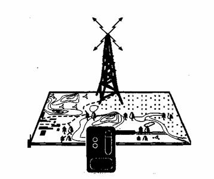

**      Ориентироваться по ширине годовых колец на пнях и густоте веток на кронах деревьев и кустов, как это иногда рекомендуется в некоторых старых книгах и справочниках, не следует. Ширина годовых колец дерева зависит от физиологических особенностей роста растения, освещенности, микроклимата. Густота кроны определяется направлением господствующих ветров (именно поэтому такие деревья иногда называют «флажковыми»), освещенностью, свободным для прорастания пространством.**  
Влажность почвы около больших камней, отдельных строений, пней служит своего
рода ориентиром — летом почва более увлажнена с севера от этих предметов, чем
с юга.  
Стороны горизонта можно найти по господствующим в данной местности ветрам,
если заранее известно их направление.  
В пустынях о направлении господствующих ветров можно судить по воздействию их
на легко разрушающиеся горные породы: песчаники, известняки, лёссы и др. Под
влиянием ветра в таких юродах часто образуются многочисленные параллельные
борозды, разделенные острыми гребнями.  
Один из признаков, по которому можно определить направление преобладающих в
данной местности ветров,— состояние растительности на склонах гор. На
наветренных склонах, сильнее промерзаю­щих зимой, растения часто бывают
наклонены, указывая этим направление господствующих ветров. На преобладание
ветров того или иного направления указывают также и флагообразные кроны
деревьев.  
В песчаных пустынях ветер создает своеобразные формы рельефа — дюны и барханы.
Барханы представляют собой холмообразные скопления песков в форме полумесяца.
Их выпуклая часть всегда обращена к ветру. С подветренной стороны склоны
барханов гораздо круче, чем с наветренной, а края вытянуты в форме рогов по
направлению ветра (рис. 14).

**  
**Рис. 14 Определение сторон горизонта по бархану 

**  
Дюны —** невысокие песчаные гряды, обычно не имеющие крутых склонов и
вытянутые перпендикулярно к направлению ветра.  
Наветренные склоны дюн и барханов уплотнены. На них нередко образуется
песчаная рябь в виде параллельных валиков. Подветренные склоны осыпающиеся,
рыхлые.  
Снег около скал, больших камней, пней оттаивает быстрее с южной стороны. В
оврагах, лощинах, ямах он быстрее оттаивает с северной стороны, потому что на
южные края углублений не попадают прямые лучи солнца, падающие с юга (рис.
15).  

Рис. 15. Определение сторон горизонта по таянию снега в овраге, по снегу,
прилипшему к камню, и лунке около дерева.  
  
На южных склонах гор и холмов образование проталин происходит тем быстрее, чем
больше крутизна склонов. У северной опушки леса почва освобождается из-под
снега иногда на 10—15 дней позднее, чем у южной. В марте — апреле вокруг
стволов отдельно стоящих деревьев и пней в снегу образуются лунки, вытянутые в
южном направлении. Весной на обращенных к солнцу склонах во время таяния снега
образуются вытянутые к югу выступы — «шипы», разделенные выемками, открытая
часть которых обращена на юг. Выше рассказано об ориентировании по различным
следам воздействия ветра на горные породы, почву и растения. Определение
сторон горизонта непосредственно по ветру возможно лишь в районах, где его
направление длительное время бывает постоянным. Различные постройки в
некоторых случаях тоже могут служить хорошими ориентирами. В основном это
сооружения религиозного культа, которые в соответствии с законами религии
строились строго ориентированными по сторонам горизонта. Алтари и часовни
православных церквей обращены на восток, а колокольне — на запад. Опущенный
край нижней перекладины креста на куполе обращен к югу, а приподнятый — к
северу (рис. 16).  

**  
**Рис. 16. Определение сторон горизонта по православному кресту. 

**  
**Алтари лютеранских церквей обращены на восток, колокольни — на запад.  
Алтари католических костелов смотрят на запад.  
Пагоды, буддийские монастыри фасадами обращены на юг.  
Кумирни (языческие молельни с идолами) тоже обращены фасадами на юг.  

Рис. 16.1. Определение сторон горизонта по признакам местных предметов

**  
**По радиосигналам. Определить стороны света возможно с помощью радиоприемника. Для этого в начальной точке маршрута надо с помощью компаса снять азимуты наиболее мощных передающих станций и радиомаяков, работающих в данной местности. Для облегчения ориентирования желательно, чтобы направление на передающую станцию совпадало с одной из сторон света или с направлением движения группы.  
При потере ориентировки достаточно приемник, работающий в диапазоне средних
или длинных волн, медленным вращением вокруг собственной оси установить в
положение наихудшего звучания. В момент, когда звук притухнет, торец приемника
укажет направление на передающую станцию. А если, например, известно, что
станция или радиомаяк находится в 400 — 500 км к северу, то нетрудно
определить прочие стороны света (рис. 17).  

**  
**Рис . 17. Определение сторон горизонта при помощи радиоприемника  

* * *

