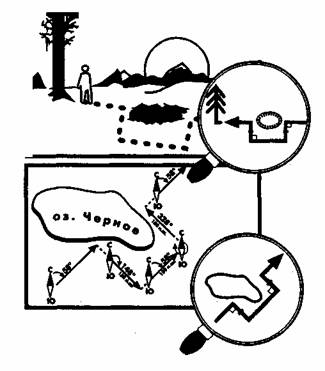

Человек, не умеющий следовать заданному курсу, обречен на хождение по кругу.
Объясняется это не его глупостью, а тем, что левый шаг человека длиннее
правого на 0,1—0,4 мм, и, ступая, по его мнению, прямо, путешественник все
более уклоняется вправо, рано или поздно возвращаясь в исходную точку своего
маршрута. Так он и будет бродить по периметру круга диаметром 3,5 км, никуда
не приближаясь, пока не научится выдерживать заданное направление.  
Кстати, подобные «круговые» блуждания на природе случаются довольно часто,
рождая многочисленные мистические рассказы и истории о том, что кто-то когда-
то не мог сойти с одного заколдованного места... По этому поводу даже
присказка есть — «леший крутит». А крутит не леший, крутит асимметрия нижних
конечностей и отсутствие элементарных навыков «прямохождения».  
Проще всего избежать бега по кругу тем, кто имеет компас. Достигается это
следующим образом. Когда с помощью карты или импровизированного плана
местности определено направление движения, надо расположенный горизонтально
компас поднести ближе к глазам, совместить поворотом компаса вокруг своей оси
северный конец стрелки с нулевой отметкой на шкале и, вращая, установить
визирное кольцо возле цифр на шкале, обозначающих курс. Затем, сквозь
совмещенные целик и мушку наблюдая местность, заметить в направлении движения
какой-нибудь ориентир — скалу, отдельное дерево и пр. (рис. 18).  
  
  
В самодельном компасе, где отсутствует визирное кольцо, мушку и целик можно
изготовить, воткнув в кору с противоположных сторон шкалы две тонкие веточки.  
В некоторых случаях для облегчения ориентировки отсутствующую градусную шкалу
можно заменить циферблатом ручных часов. Для этого цифру «12» следует принять
за 0°. Тогда каждый час будет равен 30°. В таком случае шесть часов будут
соответствовать югу, три — востоку, девять — западу.  
Расстояние до ориентира может быть различным и диктуется условиями местности.
Если ориентир располагается в пределах прямой видимости, то удаленность его
можно увеличивать до 2 — 3 км, а в исключительных случаях и более. Если
приходится двигаться в густолесье или в условиях ограниченной видимости, то
расстояние до ориентира надо уменьшить до сотен и даже десятков метров.  
Считается, что даже в самых благоприятных условиях при движении вслепую (то
есть только по компасу) ошибка может достигать 5°. Это дает отклонение от
выбранного направления до 1/10 пройденного пути. Значит, если человек прошел 1
км, отклонение может составить 100 м. И тогда взятый ориентир придется
разыскивать в радиусе 200 м (по 100 м в каждую сторону от ориентира). Если
привязкой к ориентиру пренебречь и продолжать движение только по показаниям
компаса, то через 10 км отклонение может составить уже 1 км. И это лишь при
«идеальном» пятиградусном отклонении от заданного курса! На практике подобные
ошибки, как правило, бывают много значительней. Именно поэтому в аварийной
ситуации надо стремиться выбирать ориентиры, видимые один от другого.  
Чтобы курс выдерживать более точно, желательно заметить в направлении движения
два расположенных в одной плоскости и удаленных друг от друга ориентира. В
движении нужно постоянно удерживать их в поле зрения, совмещая, словно целик и
мушку. В этом случае линия курса будет наиболее прямой.  
Если до ориентира предстоит преодолеть участок закрытой местности, можно
использовать так называемый прием упреждения азимута, то есть заведомо
отклониться вправо или влево от заданного направления на 8 — 10° и при выходе
к ориентиру повернуть вправо, если уклон был выбран левый, и наоборот — влево,
если уклон был правый.  
При однообразии пейзажа, при отсутствии на пути ориентиров (например в степи,
пустыне, на ровных ледовых полях и пр.) выдерживать заданное направление можно
по цепочке идущих людей, по отпечаткам их следов, по лыжне или с помощью
«провешивания» пути.  
Когда передвигается группа, то контроль движения ведут открывающий походную
колонну человек и замыкающий ее. Первый прокладывает путь по компасу,
последний, опять-таки с помощью компаса, корректирует его, так как при
движении сзади легко сопоставлять линию курса с линией двигающейся колонны,
легко заметить даже самые незначительные отклонения  
и ошибки. Если группа малочисленна, ее на безопасных участках целесообразно
слегка растягивать, увеличивая интервалы между людьми.  
С той же целью в малых группах можно высылать вперед штурмана с компасом,
корректировать его путь, догонять его и снова высылать вперед для прокладки
очередного участка пути.  
При движении на лыжах можно сверять курс методом обратной засечки, контролируя
направление по уже пройденному пути, то есть мысленно продолжая прямую линию
оставленной сзади лыжни и сверяя ее с данными компаса.  
Летом с той же целью можно помечать свой маршрут, оставляя за собой вбитые в
землю колышки, ветки и другие заметные ориентиры, по которым, оглянувшись
назад, можно сверить курс. Этот способ и называется «провешиванием» пути.  
Существуют и другие подробно описанные в специальной туристической литературе
инструментальные способы выдерживания направления.  
Усложняют задачу потерпевших встретившиеся на пути непреодолимые препятствия —
озера, болота, непроходимые завалы и заросли.  
Если местность открытая, то на противоположной стороне препятствия замечается
стоящий на линии курса заметный ориентир. Теперь достаточно дойти до него в
обход препятствия и, взяв азимут на следующий ориентир, продолжить путь.  
Препятствие, встретившееся на пути по закрытой местности, следует обходить
«вслепую», по компасу. Для этого надо взять курс, перпендикулярный к ранее
избранному, и пройти некоторое расстояние, подсчитывая при этом шаги. Когда
пройденное расстояние будет достаточным для обхода препятствия, надо вернуться
на прежний курс. Продолжая подсчет шагов, пройти расстояние, примерно равное
длине препятствия, снова сделать поворот на 90°, но уже в другую сторону, то
есть к препятствию, и пройти расстояние, равное подсчитанному ранее. В итоге
человек вновь окажется на нитке маршрута, но уже по другую сторону от
препятствия. Если человек промахнулся и повернул раньше, чем следовало, надо,
наткнувшись на препятствие повторить маневр, то есть развернуться на 90° или
вернуться назад, в последнюю точку поворота, и продолжить путь. Чтобы не
сбиться в подсчете шагов и поворотах, желательно на ходу вычерчивать небольшой
план, где обозначать расстояние и повороты (рис. 19).  

  
Рис. 19. Составление плана движения  
  
Много сложнее приходится потерпевшим бедствие при отсутствии компаса. В этом
случае точность выдерживания курса не будет превышать нескольких десятков
градусов. Но и за них имеет смысл бороться. Если человек идет наугад, не
контролируя свое движение, он неизбежно будет все больше отклоняться от
заданного курса и, постепенно замкнув круг, выйдет на собственные следы.
Объясняется это, как уже говорилось, несимметричностью нижних конечностей у
человека, попросту говоря, разной длиной ног.  
Отсюда размер шага левой и правой ноги тоже различен. Хоть и кажется человеку,
что он идет абсолютно прямо, на самом деле он нередко описывает в правую
сторону плавную дугу, переходящую в замкнутый круг.  
Поэтому при отсутствии компаса, определив по солнцу или местным приметам
стороны света, необходимо обратить внимание на направление движения облаков
или запомнить, в какую щеку дует ветер, конечно, если погода устойчива.
Изменение направления ветра или бега облаков в небе сигнализирует о том, что
человек сбился с курса. Чтобы легче было соблюдать движение, идущий сзади
должен контролировать направление группы, исправляя «рысканья» в ту или иную
сторону.  
С той же целью все встретившиеся на пути небольшие препятствия — деревья,
кусты, завалы и пр. — надо обходить поочередно то с правой, то с левой
стороны.  
Можно контролировать направление своего движения по солнцу, звездам, луне. '  
Легче всего использовать солнечный или лунный «компас», наблюдая за углом
между заданным курсом и тенью, отбрасываемой деревьями, кустами или самим
человеком. При этом следует помнить, что небесные светила (кроме Полярной
звезды) смещаются каждый час на 15°. Отсюда каждый час надо изменять свой курс
на 15°. Если этого не сделать, то, следуя за солнцем или луной, можно
отклониться от первоначального маршрута на 180°. Чтобы определить величину, на
которую следует скорректировать курс, надо вытянуть прямо перед собой руку и
развести под прямым углом большой и указательный пальцы. Расстояние между ними
как раз и составит величину 15°.  
В некоторых случаях (в пустыне, тундре, на льду) можно выдерживать направление
по застругам и барханам, точнее, по углу между избранным курсом и их
плоскостью. Барханы и заструги наметаются ветром и поэтому имеют повторяемую
форму, ряды их параллельны друг другу- Такую же помощь потерпевшим могут
оказать «флажковые» деревья, растущие на открытых пространствах. Наклон их в
ту или иную сторону, конфигурация кроны — с одной стороны густая, пышная,
вытянутая, с другой очень скудная, иногда полностью отсутствующая —
определяются направлением господствующих ветров. Отсюда вид «флажковых»
деревьев — величина постоянная, повторяющаяся от дерева к дереву на протяжении
десятков километров.  

* * *

