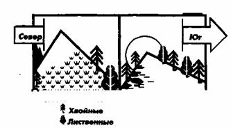
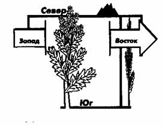

**ОЦЕНКА РАССТОЯНИЙ**  
  
Последняя составляющая аварийного ориентирования — оценка расстояний. На
практике определение расстояний обычно используется для глазомерной или
инструментальной оценки расстояния, которое предстоит преодолеть, и подсчета
уже пройденного за час, за сутки, за неделю расстояния.  
И в том и в другом случае у человека, вынужденного это делать впервые, оценки
бывают очень субъективны. Например, при определении расстояния до ориентира
«на глазок» нетренированный человек при удаленности от объекта на 0,5 км может
ошибиться на 10%, от 2 до 4 км — до 20%, свыше 4 км ошибка может достигать 50%
и более.  
Ошибки в оценке пройденного расстояния прямо пропорциональны усталости, весу
переносимого груза, рельефу местности, психологическому состоянию потерпевших.
Понятно, что измученному, голодному человеку каждый километр дается как два
или три, пройденных в нормальном состоянии, и примерно так же оценивается.
Длина километра в гору представляется много больше точно такого же километра,
но пройденного под гору. Любой трудный участок местности — болото, завал, а
также непогода — дождь, метель, сильный встречный ветер — ведут к
непроизвольному завышению оценки расстояний. Вообще замечено, что в аварийной
ситуации обычно ошибаются в большую сторону — завышают пройденное расстояние,
и почти никогда — в меньшую.  
Само по себе это не страшно, если бы не влияло на прокладку маршрута. Ошибка в
расчетах ведет к тому, что человек изменяет курс раньше, чем достигнет точки
поворота, и тем лишь усугубляет свое положение, или начинает метаться из
стороны в сторону, не достигнув в предполагаемый срок населенного пункта.  
Поэтому в аварийной ситуации желательно постоянно вести учет пройденного
расстояния. Для этого надо знать несколько простейших цифр. Так, например,
длина шага подростка в среднем составляет 0,5 — 0,6 м, взрослого человека-0,75
— 0,8 м. По ровной дороге человек проходит в час примерно столько километров,
сколько делает шагов в три секунды (при длине шага 0,8 м). Но для определения
пройденного расстояния данным способом нужно как минимум иметь секундомер, да
и точность его не, очень велика.  
Более точные цифры получаются при подсчете пройденных шагов. Удобней всего
считать шаги парами или тройками. К примеру, для человека, среднего роста,
идущего по утоптанной тропе, 60 — 62 парных шага соответствуют 100 м пути.
Натренированный человек, идущий по ровной местности, может измерять пройденный
путь с погрешностью, не превышающей 2—4%.  
Конечно, надежней всего провести эталонный замер, то есть узнать, сколько пар
или троек шагов вмещается в 100 м. Это позволит проводить замер более точно.
При отсутствии мерительных инструментов длину парного шага можно определить по
эмпирической формуле:  
**ДВОЙНОЙ ШАГ = 2 (Р/4+37),**  
_где: Р — рост человека в сантиметрах;  
4 и 37 — постоянные числа._  
При подсчете расстояния во время движения каждую сотню метров или сотню парных
(тройных) шагов надо отмечать записью или перекладыванием каких-либо мелких
предметов — веток, спичек, маленьких камешков — из одного кармана в другой.  
Надо помнить также, что длина шага меняется в зависимости от мягкости грунта и
рельефа местности. Например, при подъеме она заметно уменьшается (чем круче
склон, тем короче шаг) и, наоборот, при спуске увеличивается. На ровной
местности шаги почти одинаковы.  
Что касается определения расстояний до удаленного ориентира, то для облегчения
задачи надо разбить его мысленно на несколько известных, например, стометровых
отрезков и суммировать их.  
Или рассматривать объект одновременно нескольким наблюдателям. Результаты
наблюдений надо сложить и разделить на количество наблюдателей, то есть
получить усредненную величину.  
При этом следует помнить, что предметы кажутся ближе, чем есть на самом деле:
в ясный солнечный день, при прямом освещении, на восходе солнца, при
наблюдении лежа, если смотреть на объект через открытые, особенно водные
пространства, долины, при наблюдении снизу вверх, например, от подножия
возвышенности к вершине. Ярко освещенные предметы и крупные (большие строения,
группы деревьев и пр.) кажутся ближе слабоосвещенных и мелких. Точно так же
визуально приближаются предметы, находящиеся на ровном месте, в сравнении с
предметами, расположенными на неровной, холмистой поверхности.  
И наоборот, объекты «удаляются» от наблюдателя: в пасмурные дни, дождь, туман,
сумерки, при наблюдении против света и на закате солнца, при наблюдении сверху
вниз, от вершины к подножию. Предметы темных цветов (синие, серые, черные,
коричневые) кажутся дальше, чем яркие (белые, желтые, красные).  
Кроме того, существуют другие, более сложные способы оценки расстояний, о
которых можно прочитать в специальной литературе.  
В большинстве своем приемы аварийного ориентирования универсальны для всех
климатогеографических зон. Но существуют и некоторые отличия.  
Например, в горах из-за сложного рельефа местности, обилия крутых склонов и
глубоких ущелий и т. п. надо с осторожностью применять способы, основанные на
развитии и росте растений в зависимости от их освещенности — густоте травяного
покрова, наличии грибов, созревании ягод и т. п. Кроме того, ошибочным может
оказаться ориентирование по виду коры, выростам мха на стволах, по
расположению и конфигурации муравейников и т. п. Все эти способы наиболее
действенны на равнинной местности, в редколесье.  
Большие погрешности в горах южных регионов страны в летний период времени дает
способ определения сторон света с помощью солнца и часов.  
Очень сложно в горной местности определять расстояния «на глаз». Точно так же
затруднено определение расстояний с помощью подсчета шагов, так как величина
шага значительно варьируется в ту или иную сторону, в зависимости от крутизны
склона и вида почвы.  
В горной местности нужно осторожно относиться к показанию компаса. В горах
могут встречаться участки с сильно выраженными местными магнитными аномалиями,
вызванными присутствием металлосодержащих пород. Поэтому следует периодически
проверять показания компаса с помощью наиболее надежных астрономических
способов ориентировки (по Полярной звезде, полуденной тени).  
С другой стороны, в горах существуют специфические, применимые только там,
способы аварийной ориентировки. Например, направление на север можно
приблизительно определить по внешнему виду горных склонов. Так, если на одном
склоне густо растет дуб, а на другом — бук, то первый почти всегда обращен к
югу, второй — к северу. Дуб и сосна чаще покрывают южные склоны, ель, пихта —
северные. Иначе говоря, тепло- и светолюбивые деревья тяготеют к склонам,
обращенным к югу, холодостойкие — к северным. Лес и луга по южным склонам
поднимаются выше, чем по северным (рис. 20). Южные склоны бывают суше
северных, они менее задернованы и сильнее подвержены процессам размыва.  
В целом аварийное ориентирование в горах сводится к спуску из зон высоко- и
среднегорья в предгорья, к выходу к гарантированно узнаваемым площадным
ориентирам (озерам, долинам, плато),  

Рис. 20. Определение сторон горизонта по склонам холмов.  
  
линейным (дорогам, тропам, рекам и пр.) и точечным (обычно образованным
слиянием площадных и линейных ориентиров, а также отдельным маркировочным
турам, базам, лагерям).  
В лесотундровой и тундровой зонах при невозможности наблюдения небесных светил
можно ориентироваться по расположению веток и общему наклону стволов
«флажковых» деревьев. Для этого надо заранее узнать у местного населения
направление господствующих ветров. Например, если для данной местности
характерны северные ветра, наклон деревьев и преобладание веток на стволах
будут указывать на юг. Очень многие северные народности в совершенстве умеют
владеть ветровым компасом. В подтверждение можно процитировать Г. А.
Федосеева, рассказывающего о своем слепом (!) проводнике Улу-киткане:  
«Мы перешли небольшое болото и снова погрузились в густой смешанный лес. Опять
не осталось ориентиров. Чувствую, что иду не туда. Случайно на глаза попалось
гнездо белки, и я сейчас же сообщил об этом старику.  
— Проверь по нему, ладно ли мы идем, — сказал он.  
— А как проверить?  
— Вход в гайно всегда за ветром, а ветер тут зимою идет с запада...  
Я, оказывается, вел караван в обратном направлении...» ч  
Кроме того, на Крайнем Севере облегчить ориентирование могут конфигурация и
расположение на поверхности снега застругов и надувов. Надо лишь в начале пути
с помощью компаса уточнить их направление относительно магнитного полюса.
Например, как утверждают знатоки, в центральном полярном бассейне, где
преобладают южные ветры, крутая, обрывистая сторона надува указывает
направление на север, более пологая, наветренная — на юг. На арктических
островах, где чаще дуют восточные ветры,— обрывистая, подветренная сторона
развернута к западу. Но в целом «ветровым» приметам доверяться надо с большой
осторожностью и пользоваться только в крайнем случае.  
Летом в тундре помочь сориентироваться могут растения. К примеру, возле
болотных кочек с южной стороны, которая лучше прогревается солнцем, ягоды
брусники, черники, морошки, голубики, клюквы и пр. поспевают раньше, чем на
северной стороне. Лишайники (мхи), относящиеся к роду кладония (иногда их
называют ягелем или оленьим мхом), бывают с северной стороны более темными.
Если идти на север, светло-серая поверхность мохового (лишайникового) покрова
будет иметь заметный темный налет; двигаясь в противоположную сторону, человек
этого налета не увидит.  
Точно так же, как в горах, в тундре надо контролировать показания магнитных
компасов с помощью астрономических способов ориентирования, так как в высоких
широтах аномальные магнитные склонения могут достигать значительных (до
нескольких десятков градусов) величин.  
В степи и пустыне, благодаря малооблачной, сухой погоде, наиболее применимы
астрономические способы аварийного ориентирования. Можно также ориентироваться
по внешнему виду и расположению волн барханов, обычно формируемых
господствующими для данной местности ветрами. Так, в некоторых южных пустынях
бывшего Советского Союза летом наветренные, пологие склоны барханов обычно
обращены на север, а крутые, осыпающиеся — на юг, так как в это время года
более часты северные ветры. Зимой, наоборот, пологие склоны барханных цепей
обращены к югу, а крутые — на север, потому что зимой преобладают южные ветры.
Но безоговорочно этой примете лучше не доверять, и по возможности проверить ее
с помощью компаса или астрономических наблюдений.  
В южных степях широко распространено двухлетнее травянистое растение латук
(или дикий салат), листья которого на стебле обращены плоскостями на запад и
восток, а ребрами — на север и юг. Для наблюдения следует выбирать растения,
растущие на сухом, открытом, незатененном месте. У латука, растущего во
влажных, затененных местах, листья на стебле располагаются произвольно, во все
стороны (рис. 21).  

  
Рис.21. Определение сторон горизонта по растениям.  
Во многих районах страны существуют свои, уникальные для данной местности,
приемы аварийного ориентирования. Например, на Южном Урале, в зоне лесостепи,
южные склоны гор каменистые, заросшие травой, северные — покрыты редким
березовым лесом. На некоторых северных реках камни на берегах с северной
стороны густо обрастают мхом. На юге Приморского края бархатное дерево
встречается исключительно на северных склонах гор, дуб — на южных и т. п.
Перед походом желательно поинтересоваться у населения местными приметами. В
случае аварии это может значительно облегчить ориентировку.  
В море, большом озере основной задачей аварийного ориентирования является
поиск ближайшей к месту аварии суши. Для этого надо восстановить по памяти
карту местности, с помощью астрономических наблюдений определить стороны света
и, вычислив курс, двигаться к берегу. При прокладке курса необходимо учитывать
силу и направление ветра, течений, береговой рельеф в месте предполагаемой
высадки.  
Из множества примет, говорящих о близости земли, здесь я упомяну только одну,
но универсальную, пригодную почти для всех морей и океанов. Если в море над
горизонтом недвижимо застыли тучи или отдельное облако, значит, почти
наверняка там располагается суша. В тропических зонах океана чуть не каждый
остров имеет свое персональное маленькое облачко.  
Заключить эту главу я хочу «крамольным» советом.  
Признаюсь: все здесь написанное — все рекомендации, все приемы аварийного
ориентирования не стоят одного: простейшего ученического компаса! Не
«перетягивают» они его! А потому, если вам предстоит отправиться в лес, степь,
горы или просто на воскресную прогулку в пригородную рощу, не поленитесь,
прихватите его с собой. Компас легок, поместится в любом кармане, а польза от
него в аварийной ситуации превеликая!  
Удобнее всего жидкостный компас. Он надежен, неприхотлив в обращении, не
боится холода, занимает мало места, погруженная в жидкость стрелка
успокаивается гораздо быстрее, чем у его «воздушных» собратьев. Человеку, у
которого есть компас или хотя бы магнитная стрелка от компаса, на вопрос: «В
какой же стороне находится этот проклятый север?» — ответить будет несравнимо
легче! И не придется ползать на четвереньках под деревьями и под камнями,
выискивая мох да лишайник.  
А компас всё равно купите!  

* * *

