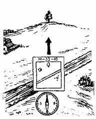
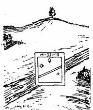
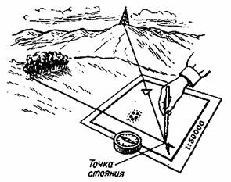
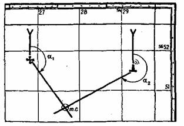

**ОРИЕНТИРОВАНИЕ НА МЕСТНОСТИ ПО КАРТЕ**  
  
Ориентирование по карте с отдельных точек местности позволяет точно определить
свое местонахождение.  
Ориентирование на месте (топографическое ориентирование) включает
ориентирование карты, определение точки своего стояния и сличение карты с
местностью. Все эти действия взаимосвязаны, и опытный человек обычно выполняет
их в комплексе, без разделений. Но новичкам отработку приемов лучше вести по
этапам: вначале освоить приемы ориентирования карты, затем приемы определения
точки своего стояния и после этого приступить к детальному сличению карты с
местностью, или, как говорят специалисты, к опознаванию окружающих местных
предметов и элементов рельефа.  
Ориентирование карты. Ориентировать карту – значит повернуть ее так, чтобы
верхняя сторона рамки была направлена на север. Ориентирование карты должно
производиться согласно показаний компаса. Для этого карту поворачивают так,
чтобы вертикальные линии сетки карты были параллельны стрелки компаса (рис.
22).  

  
Рис 22. Ориентирование карты по компасу  
  
Если ориентирование нужно произвести как можно точнее, то учитывают поправку
магнитного склонения. Для этого компас прикладывают к вертикальной линии
координатной сетки и ориентируют карту на север. Затем карту с компасом
поворачивают до тех пор, пока северный конец стрелки компаса не подойдет к
делению, соответствующему величине поправки, указанной внизу карты. Можно
ориентировать карту и по линейным ориентирам, имеющимся на карте и опознанным
на местности (рис. 23).  

  
Рис 23. Ориентирование карты по линиям местности  
  
  
При ориентировании, например, по дороге карту поворачивают так, чтобы
направление условного знака дороги совпало с направлением дороги на местности.
Необходимо убедиться, что предметы справа и слева от дороги имеют такое же
расположение, как и на карте. Если это условие выполнено, то карта
ориентирована правильно.  
Ориентирование карты – самый простой и самый важный процесс ориентирования.
Необходимо твердо усвоить, что нельзя работать на местности с
неориентированной картой. Это приводит к дополнительной трате времени и грубым
ошибкам в определении точки стояния и местоположения различных объектов.  
Определение точки своего стояния выполняется различными способами. Проще всего
определить точку стояния, когда она находится около какого-либо местного
предмета, изображенного на карте. Допустим, что мы находимся на шоссе у
переезда через железную дорогу. Найдем на карте изображение железной дороги и
шоссе. Место пересечения условных знаков шоссейной и железной дорог укажет
нашу точку стояния.  
Имея подробную карту или схему, можно определить точку стояния путем сличения
карты с местностью. Наблюдая окружающие ориентиры на местности,
последовательно отыскивают их на карте и определяют, на каком из них или
поблизости от которого находится ваша группа.  
Несколько труднее определить точку стояния в том месте, где поблизости нет
местных предметов. В таких случаях применяют различные способы засечек.
Наиболее общий способ заключается в следующем. На местности находят два
заметных предмета или ориентира и опознают их на карте. Затем карту
ориентируют с помощью компаса и проводят на ней направления от самих предметов
через их условные знаки. Точка пересечения этих направлений будет точкой
вашего стояния (рис. 24).  

  
Рис. 24. Определение точки стояния обратной засечкой.  
  
  
Если намеченные предметы (ориентиры) находятся на значительном удалении от
точки стояния, целесообразно применить компасную засечку. С помощью компаса
определяют обратные азимуты A1, A2 на ориентиры. Значения их отсчитывают на
лимбе компаса по противоположному к ориентиру указателю. В полученные отсчеты
вводят поправку направления и в результате получают дирекционные углы а,, а2 -
Их  
значения откладывают на карте у соответствующих ориентиров от северного
направления координатных линий и прочерчивают прямые линии. Пересечение их
укажет точку стояния (рис. 25).  

  
Рис. 25. Определение точки стояния компасной засечкой.  

* * *

