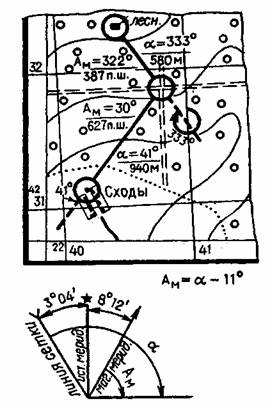
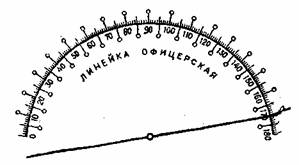
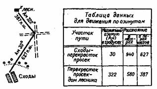
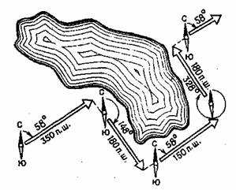

**ДВИЖЕНИЕ ПО АЗИМУТАМ**  
  
В процессе перехода может применяться «грубое» движение по направлению с
использованием в качестве ориентиров небесных светил, местных предметов или
стрелки компаса (по стрелке, перпендикулярно стрелке) и точное движение — по
азимуту.  
«Грубое» движение применяют на сравнительно небольших расстояниях при выходе
на линейный ориентир, расположенный перпендикулярно или под углом до 60° к
направлению движения, или большой площадной ориентир.  
  
При действиях на однообразной местности (в лесу, степи, пустыне), а также в
условиях ограниченной видимости и ночью применяется движение по азимутам.  
Разработка маршрута. На карте, по возможности наиболее крупного масштаба,
определяют начальную и конечную точки маршрута и соединяют их прямой линией.
Если расстояние между ними небольшое, то передвигаться можно по одному
направлению. Если расстояние значительное, местность по прямому пути
малодоступна для передвижения или есть места, которые нужно обойти, то
намечают один или несколько поворотов. В общем, маршрут выбирают с таким
расчетом, чтобы он проходил по доступной местности, огибал опасные места и
населенные пункты, а повороты располагались поближе к линии, соединяющей
начальную и конечную точки маршрута. В любом случае необходимо учитывать
конкретную обстановку и выбирать маршрут таким образом, чтобы избежать встречи
с противником.  
  
Повороты должны намечаться у ориентиров. Ориентиры потребуются для контроля
выдерживания маршрута. Количество их и расстояния между ними устанавливают в
зависимости от характера местности, способа передвижения и времени суток. В
качестве ориентиров выбирают предметы, хорошо опознаваемые на местности. При
движении ночью в качестве ориентиров следует использовать такие местные
предметы и детали рельефа, которые можно опознать в темноте. Во всех случаях
предпочтение отдают площадным ориентирам, особенно имеющим характерные детали
(например, поляна, по которой идет дорога, озеро с впадающим в него ручьем и
т. п.). Если нужно выйти на незначительный по разменам ориентир, расположенный
на дороге, пересекающей намеченный путь, азимут следует брать на 5—10° левее
или правее этого ориентира, чтобы, выйдя на дорогу, знать, в какую сторону
повернуть.  
В стороне от маршрута желательно наметить крупные ориентиры, видимые издалека.
По ним можно уточнить свое местонахождение или исправить ошибку, если группа
собьется с маршрута.  
  
Выбранные поворотные ориентиры обводят на карте кружками и соединяют их
прямыми линиями. Попутно изучают по карте местность вдоль маршрута и
запоминают отдельные ее детали, важные для контроля правильности движения.  
С высокой точностью можно двигаться в створе ориентиров. Смысл приема в том,
что на линии движения находят два ориентира. В процессе движения нужно
стараться идти так, чтобы эти ориентиры постоянно находились на одной линии,
или, как говорят специалисты,— в створе.  
Подготовка данных для движения по азимутам. Данными для движения служат
магнитные азимуты и расстояния по каждому участку маршрута.  
Рассмотрим пример подготовки данных для передвижения от населенного пункта
Сходы до дома лесника (рис. 26). На этом маршруте можно ограничиться только
одним поворотом, наметив его на пересечении просек. Таким образом, маршрут
проходит по двум участкам: Сходы — перекресток просек и перекресток просек —
дом лесника. Магнитные азимуты определяют в следующем порядке. По каждому
участку измеряют транспортиром дирекционный угол. Для первого направления он
равен 41°, для второго — 333°. Дирекционный угол (а) — это угол между
вертикальной линией координатной сетки и линией направления движения. Но это
еще азимуты. Чтобы определить значение азимута (Aм), нужно учесть поправку на
величину магнитного склонения и величину угла между линией сетки и линией
истинного меридиана. Все эти значения указаны внизу карты.  
  
Затем от значения дирекционного угла ' нужно вычесть значение поправок на
магнитное склонение и угла истинного меридиана, которое в нашем примере
составляет 11 °. В результате мы получим, следующие значения азимутов (Aм):  
первый переход (Сходы — перекресток просек) — 30°;  
второй переход (перекресток просек — дом лесника) — 322°.  
Поправка для перехода от азимута к дирекционному углу распространяется на
довольно обширный район. Поэтому, чтобы каждый раз не заниматься вычислениями,
эту величину можно заранее отметить на транспортире. Допустим, поправка
составляет минус 9°. Сделаем на транспортире отметку в соответствующем месте и
процарапаем линию (рис. 27), которая станет теперь как бы новым основанием
транспортира.  
  
  
Рис26. Данные для движения по азимутам готовятся с учетом поправки
направления.  
  
Рис. 27. Транспортир, приспособленный для измерения азимутов на карте  
Для измерения азимуту на карте транспортир прикладывают так, чтобы его новое
основание было совмещено с вертикальной линией сетки.  
Для движения по азимутам необходимы только угловые данные (азимуты), но и
расстояния между ориентирами. Расстояния меряют по карте известными способами
нашем примере они получились равными с. и 580 метров. При пешем движении
расстояния в метрах переводят в пары шагов. Каждый человек должен знать длину
своей пары шагов. В среднем она считается 1,5 метра при ходьбе обычным шагом.
Данные для движения по азимутам обычно подписываются на карте, но лучше их
свести в отдельную таблицу или подписать на схеме движения, составленной по
карте  
  
Рис. 28 Схема и таблица данных для движения по азимутам  
  
Выдерживание маршрута. Прежде чем начинать движение, надо внимательно изучить
схему маршрута на карте. На исходном пункте определяют по компасу направление,
соответствующее значению первого азимута. Для этого устанавливают указатель у
мушки на отсчет, равный заданному азимуту, и ориентируют его так же, как и при
определении азимута на предмет, то есть совмещают северный конец стрелки с
нулевым штрихом. Не сбивая ориентировки компаса, смотрят на местность по линии
через прорезь и мушку и замечают в этом направлении какой-либо удаленный
местный предмет. Это будет вспомогательный ориентир, который в дальнейшем
используют для выдерживания направления пути. Желательно, чтобы
вспомогательный ориентир был расположен дальше поворотного ориентира, а еще
лучше — на горизонте (например, зарево пожара). Но если местность этого не
позволяет, можно выбрать ориентир, расположенный ближе поворотного. Им может
быть любая хорошо заметная деталь местности, находящаяся на линии данного
участка пути. В этом случае по достижении вспомогательного ориентира снова
определяют на местности направление, соответствующее значению азимута, и
намечают в этом направлении следующий ориентир. Заметив вспомогательный
ориентир, начинают двигаться по направлению к нему, пока пройденное расстояние
не покажет, что первый поворотный ориентир должен быть достигнут. Здесь
останавливаются, отыскивают намеченный ориентир и с него определяют
направление по компасу на следующий поворотный ориентир. Таким образом
продолжают движение до конца маршрута.  
Если на пути встретится препятствие, не показанное на карте, надо наметить на
другой его стороне ориентир, лежащий в направлении пути. Выбрав наиболее
удобный путь обхода препятствия, доходят до намеченного ориентира и продолжают
движение от него по тому же азимуту. Понятно, что отсчет шагов от этого
ориентира следует уже вести с учетом ширины препятствия.  
Обход больших препятствий и препятствий на закрытой местности совершают с
помощью компаса по сторонам прямоугольника (рис. 29).  
  
  
Рис. 29. Обход препятствий по перпендикулярам.  
Допустим, что движение совершалось по азимуту 58°. До остановки перед
препятствием пройдено 350 пар шагов. После осмотра местности принято решение
обойти препятствие с правой стороны. Изменяют азимут на 90° и идут в этом
направлении до конца препятствия, отсчитывая пары шагов. На рис. 29 азимут
равен 148°, а расстояние — 180 парам шагов. Затем определяют по компасу
направление, соответствующее первоначальному азимуту, по которому совершалось
движение до препятствия (58°), и двигаются в этом направлении до выхода за
препятствие. Пройденное расстояние (150 пар шагов) прибавляют к расстоянию,
пройденному до препятствия, то есть к 350 парам шагов. Если теперь пойти влево
по азимуту, измененному на 270°, и пройти те же 180 пар шагов, которые были
сделаны вдоль препятствия, то попадем в точку, расположенную за препятствием
на продолжении первоначального направления пути. От этой точки продолжают
движение к намеченному ориентиру по первоначальному азимуту.  
Обходить возникающие на пути препятствия можно и другими способами. Нужно
только измерять и записывать азимуты всех направлений и расстояния, пройденные
по ним.  

* * *

