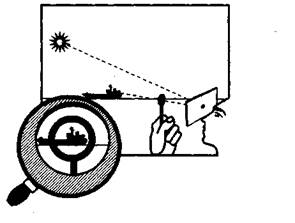
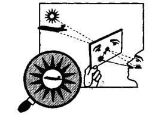
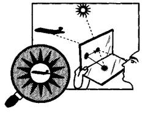
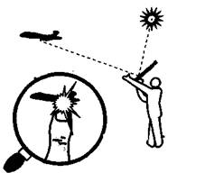
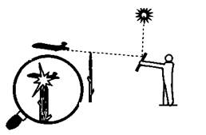
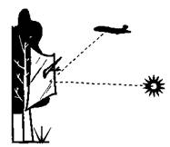
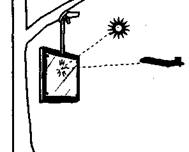

* * *  
  
**СИГНАЛЬНОЕ ЗЕРКАЛО**  
  
Или, как его называют в специальной литературе,— гелиограф, в дословном
переводе обозначает «пишущий солнцем», что объясняет его назначение.  
Инженеры подсчитали, что яркость светового сигнального зайчика при угле
стояния солнца в 90° составляет без малого 7000000 свечей! Вспышка сигнального
зеркала в безоблачный, солнечный день обнаруживается с самолета, летящего на
высоте 1 — 2 км, на расстоянии в 20 — 25 км, а в некоторых случаях — до 40 км!
Сигнальным зеркалом можно давать аварийный сигнал не только днем, но и ночью в
полнолуние и даже в туманной дымке.  
Известно много типов сигнальных зеркал, в том числе и недавно появившиеся и
ставшие доступными нашему путешественнику образцы, представленные в каталогах
туристического снаряжения многих западных стран. К примеру, новая модель
сигнального зеркала "Maudau" обеспечивает точность подачи светового сигнала на
расстояние свыше 30 км. Еще одним его достоинством является то, что оно не
тонет в воде.  
Рассмотрим три наиболее распространенных типа зеркал, используемых в
отечественных спасательных комплектах.  
Сигнальное зеркало с целиком (рис. 1) представляет из себя металлическую
пластину, отполированную с одной стороны до зеркального блеска. В центре
пластины находится круглое, чуть больше спичечной головки, отверстие. Через
это отверстие и отверстие в удерживаемом с наружной стороны зеркала целике
следите за движением интересующего вас объекта (самолета, судна, человека).
Одновременно поймайте отраженный от поверхности зеркала «зайчик» на целик. На
нем же — целике — найдите тень от крестообразной насечки, нанесенной на
рабочей поверхности зеркала. Совместите центр насечки с отверстием на целике и
продолжайте следить за объектом.  

---

Рис. 1. Сигнальное зеркало с целиком.  
Простейшее сигнальное зеркало можно изготовить из отполированной с двух сторон
до зеркального блеска металлической пластины размером с книгу среднего
формата. Понятно, что чем лучше отполирована рабочая поверхность зеркала, тем
дальше виден световой сигнал. В центре пластины пробейте круглое, диаметром 57
мм, отверстие. Взяв зеркало, как показано на рис. 2, через отверстие
наблюдайте за самолетом (судном). Не теряя объект слежения, поворачивайте
зеркало к солнцу. Найдите световой блик (проходящий через отверстие солнечный
луч) на лице или одежде. Зеркальное отражение блика на обратной поверхности
зеркала совмещайте с отверстием. При совпадении отверстия с отраженным бликом
световой сигнал направлен на самолет.  

---

Рис. 2. Простейшее сигнальное зеркало  
Двойное сигнальное зеркало (рис. 3) состоит из двух соединенных друг с другом
с помощь небольших петель зеркальной и матовой створок. Размер наиболее часто
используемого в индивидуальных аварийных комплектах малого сигнального зеркала
составляет 5x8 см. Принято считать, что дальность обнаружения его сигнала
может достигать 14 км. Большое сигнальное зеркало имеет размеры сторон 12,5x8
см и может быть замечено на расстоянии, превышающем 30 км.  

  
Рис. 3. Двойное сигнальное зеркало  
В аварийной ситуации матовую створку двойного сигнального зеркала можно
изготовить из куска фанеры, пластмассы и даже толстого картона. Петли можно
сделать из свернутой в кольца тонкой металлической проволоки или «сшить»
створки с помощью крепкой нити. Чтобы подать сигнал, раскройте створки до
упора (примерно под углом 60 — 70°) и через отверстие, проделанное в центре
зеркала, следите за целью. Видимое с обратной стороны зеркала солнечное пятно,
упавшее на матовую створку, совместите с отверстием. Следите за движущейся
целью, непрерывно совмещая пятно с отверстием.  
Сигнальное зеркало — в работе достаточно сложный инструмент, поэтому научиться
с ним обращаться, желательно заранее. Вникать в инструкцию в тот момент, когда
над головой гудит самолет, поздно. Чтобы понять принцип работы зеркала,
необходимо потренироваться в подаче сигнала, используя в качестве объекта
слежения близкорасположенный предмет, на котором будет хорошо различим
сигнальный «зайчик».  
Подавать световой сигнал зеркалом имеет смысл  
не только непосредственно заметив са­молет или судно,  
но и на всякий напоминаю­щий гул моторов звук.  
В отличие от ракет, зеркалу от этого не убудет.  
Оно, если с ним правильно обращаться,— «вечное».  
Более того, некоторые памятки рекомендуют периодически пробегаться световым
«зайчиком» вдоль линии горизонта, так как известны случаи, когда пилоты
поисковых самолетов замечали этот посланный наугад сигнал много раньше, чем
потерпевшие были способны увидеть или услышать сам самолет.  
Обычное одностороннее зеркало, не имеющее отверстия, тоже можно применять для
направленной подачи сигнала бедствия. Для этого надо, удерживая зеркало одной
рукой близко от лица или даже прижимая задней стенкой к щеке, повернуть его
таким образом, чтобы отраженный луч («зайчик») был направлен в нужную сторону.
Затем вытянуть другую руку в направлении объекта визирования и «посадить» его
на кончик отведенного большого пальца. Поворачивая плоскость зеркала,
добиться, чтобы отраженный блик попал на большой палец. Продолжая удерживать
большой палец на объекте и одновременно в луче «зайчика», поворачиваться в
направлении движения самолета или судна (рис. 4).  

  
Рис. 4. Использование обычного зеркала.  
Более сложный вариант заключается в наведении сигнального «зайчика» через
верхушку вбитой в землю высокой палки-мушки. Для этого надо на ее кончик
«посадить» объект визирования, за­тем навести световой сигнал и удерживать их
— «зайчик» и объект — в таком положении, смещаясь корпусом в требуемую
сторону. Пока вы видите на срезе палки самолет и свет солнечного зайчика —
сигнал гарантированно направлен в сторону самолета. Этот способ обычно
применяется, когда потерпевшие располагают тяжелы (например, металлическим)
листом или объемны (станиоль, фольга) зеркалом, которое удобнее удерживать
двумя руками (рис. 5).  

  
Рис. 5. Второй вариант использования  
отражающих или зеркальных листов.  
Для постоянной и, так сказать, автоматической подачи светового сигнала
бедствия импровизированное зеркало можно попытаться закрепит с помощью
простейших вязок или резинок на лбу или на головном уборе, по возможности
параллельно плоскости глаз. И идти куда требуется стараясь, чтобы световой
«зайчик» бегал вдоль линии горизонта. Прослеживать направлен блика можно на
близких предметах — земле, листве кустов и деревьев. Постепенно у человека
вырабатывается «чувство луча» и он посылает зайчик куда нужно, не задумываясь,
одним-единственным поворотом головы.  
Самодельное сигнальное зеркало можно изготовить из жести, металлической
фольги, обертки от шоколада и конфет, нескольких обычных карманных зеркал,
сколов слюды, осколков настенного зеркала, висевшего в туалете потерпевшего
катастрофу самолета, или зеркала заднего вида автомобиля и т. д. Далеко виден
блеск широкого лезвия ножа, дна консервной банки, полотна пилы-ножовки и пр.  
Чтобы убедить скептически настроенного читателя в действенности подобных
импровизированных зеркал, можно сослаться на один исторически прецедент:  
«...Чечони, который раньше обещал, что покажет всем остальным, как надо
сигнализировать, решил использовать зеркало: тонкую деревянную дощечку оклеил
блестящими листочками станиоля. Ему посчастливилось — солнечный зайчик,
отраженный от его примитивного зеркала, попал Маддаленте прямо в глаза и был
(если не считать радио) единственным сигналом, который летчик своевременно
заметил»,— так писал в своих воспоминаниях Бегоунек, один из участников
трагедии, случившейся в 1928 году с дирижаблем «Италия». Станиоль от плитки
шоколада, обычная золотинка, спасла людям жизнь!  
Светоотражающие свойства металлической фольги можно с успехом использовать не
только в сигнальных зеркалах. Например, в непосредственной близости от лагеря
будет полезно развесить полоски фольги на ветках одиноко стоящего дерева.
Блестя на солнце, они будут издалека привлекать внимание (рис. 6 ).  

  
Рис. 6. Импровизированное сигнальное зеркало.  
С той же целью можно раскладывать на склонах холмов листы фольги,
предварительно несильно их смяв для образования множества отражающих
плоскостей.  
Наконец, можно прикрепить фольгу к куску фанеры, доске или раздвоенной на
конце ветке и полученную блестящую пластину свободно подвесить на открытом
месте на верхушке вбитого в землю высокого шеста. Пластина, постоянно вращаясь
на ветру, будет давать хорошо заметные световые сигналы (рис. 7).  

  
Рис. 7. Еще один вариант импровизированного сигнального зеркала.  
Кроме фольги и лучше, чем фольгу, использовать для аварийней сигнализации
металлизированные пленки. Упрощенно говоря, это тот же полиэтилен, но с
нанесенным на его поверхность тонким металлическим слоем белого, золотистого
или иного цвета (в настоящее время с подобным покрытием изготавливаются
туристические коврики). Такая пленка легче и компактней фольги и за счет
тягучести более прочна.  

* * *

