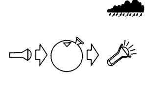

* * *

**СИГНАЛИЗАЦИЯ  
ЗВУКОВАЯ СИГНАЛИЗАЦИЯ**  
  
Для подачи звуковых сигналов бедствия существуют специальные пиротехнические
петарды, которые срабатывают через 6—10 с после приведения их в действие.
Сигнал такой петарды может быть услышан на расстоянии до 6 — 8 км.  
Звуковыми «добавками» снабжаются некоторые сигнальные ракеты. Обычно это свист
или вой, который длится все то время, пока горит световой сигнал ( ракета
сигнальная комбинированная).  
Звук свистка слышен по меньшей мере вдвое дальше, чем крик. И даже втрое, если
используются специальные сигнальные свистки.  
Привлечь внимание спасателей могут ритмично звучащие выстрелы.  
Звуковым сигналом бедствия считаются отдельные громкие звуки,  
производимые с промежутками через 1 мин.  
Либо группы из шести отдельных звуков, разделенные паузой.  
Либо беспрерывный звуковой сигнал — свист, вой туманного горна.  
При подаче звуковых сигналов необходимо занять как можно более высокую
позицию. При этом следует помнить, что любые препятствия «съедают» силу звука,
что наиболее действен сигнал, пущенный по ветру, и что туман не является
препятствием для распространения звуков, а, напротив, усиливает их.

**  
ЭЛЕКТРИЧЕСКИЕ СРЕДСТВА СИГНАЛИЗАЦИИ**  
  
Наиболее полезны для людей, потерпевших бедствие, специальные проблесковые
фонари с ксеноновыми лампочками, дающими вспышку света, видимую на расстоянии
до 10 км.  
Но не будут лишними и обыкновенные электрические фонарики. Сигнал, поданный
сильным фонарем, «читается» за 3 — 4 км, слабым — до 2 км. Следует отдать
предпочтение фонарям с наиболее прочным и герметичным корпусом, с мощным,
просветленным отражателем, дающим максимально плотный, узко направленный луч
(«точку») в центре светового круга. Отражатели, рассеивающие свет, многократно
уменьшают предел его обнаружения. Плотность и расположение «точки» в световом
круге во многом зависит от положения спирали в лампочке, поэтому лучше
перебрать их несколько (или даже несколько десятков), отсеяв наиболее удачные.  
Удобны, с точки зрения аварийной сигнализации, различные автомобильные
проблесковые электрофонари. Они экономичнее расходуют заряд батарей и больше
обращают на себя внимание.  
Батарейки в сигнальном фонарике следует использовать наиболее надежные и
«емкостные», пусть даже они будут дороже обыкновенных.  
Но лучше всего, отправляясь в путешествие, брать с собой механические
фонарики-«жучки», для которых батарейки не требуются. И обязательно несколько
запасных лампочек! Так как в подобных ручных, дающих рваное напряжение,
фонариках лампочки могут перегорать довольно часто.  
Зная азбуку Морзе, с помощью фонаря, открывая и закрывая отражатель, можно
переда­вать сигнал бедствия и другие сообщения. Сигнал SOS: три точки —
короткая пауза — три тире — короткая пауза — три точки (· · · − − − · · · )  
Имеющийся в распоряжении потерпевших бедствие электрический фонарик очень
важно защитить от осадков и воздействия отрицательных температур. Для этого,
особенно в сильный мороз, держать его и переносить следует только под одеждой,
чтобы батарейки не охлаждались и не подсаживались. Но так, чтобы его можно
было при необходимости быстро вытащить.  
От осадков фонарик проще всего укрыть, засунув в воздушный шарик, простите,
презерватив, или целый (проверить надувом!) полиэтиленовый мешок (рис. 2).  

  
Рис. 2. Укрытие электрического фонарика в дождливую погоду.  
Севшие батарейки можно попытаться «вернуть к жизни», постукивая с боков о
камни или «прожаривая» на огне. В некоторых случаях (но далеко не всегда) эти
способы ненадолго возвращают в омертвевшие батарейки пропавшее напряжение.  
Для подачи светового сигнала бедствия можно использовать фотовспышки,
вмонтированные во многие современные фотоаппараты. Фотовспышки отличаются
сильным, но очень коротким свечением, которое можно принять за случайный блик.
Отсюда очень важно, чтобы сигнал, подаваемый фотовспышкой, периодически
повторялся. Давать его надо на максимально возвышенном и оголенном участке
местности. Очень хорошо, если отражающий фон будет светлый. В обычных
фотоаппаратах одной зарядки батареек хватает на 30 — 35 вспышек.  
В морских и авиационных индивидуальных и коллективных спасательных средствах
используются различные водоналивные батареи, которые срабатывают при
заполнении их корпуса водой. Они питают напряжением 3 — 6 В лампочки,
помещенные в водонепроницаемые прозрачные колпачки, закрепленные на
спассжилетах и на тентах спасательных плотов и лодок. Водоналивные батарейки
имеют одноразовое использование и после 20 — 40 ч работы выбрасываются. Время
выхода на расчетное напряжение у батареи «Маячок-1», которая используется для
питания сигнального огня в спассжилетах, составляет: в соленой воде при
околонулевых температурах — не более 25 мин, при 15 — 20" — 3 мин, при 20° и
более — 1 мин; в пресной при 3 — 5° — не более 30 мин, при 15 — 20° — не
бо­лее 15 мин, при 20 — 30 —5 мин. В более мощной батарее «Маячок-2»,
предназначенной для обеспечения светом спасательных плотов и лодок, время
выхода на расчетное напряжение несколько большее. Но это время конструктивное,
так сказать, с запасом, на практике батарейки начинают работать, как правило,
быстрее.  
В комплекте со спасательными кругами используются иногда свето-дымящиеся буи.
Длина такого буя 850 мм, диаметр 250 мм, вес 13 кг. Сигнальный свет дают две
расположенные в верхней части поплавка лампочки, питающиеся от блока
водоналивных батарей. Продолжительность непрерывного свечения лампочек — 2 ч.
Дальность видимости — около 2 км. В дневное время, когда световой сигнал
бесполезен, срабатывает дымовой сигнал, непрерывно действующий в течение 15
мин .  
К пассивным световым сигнальным средствам можно отнести различные
светоотражающие пленки, используемые в авиационных и морских спасательных
средствах.  
В светоотражающих пленках используется эффект отражения попадающего на них
света. Пленки обычно наносятся в виде пунктирных полос или геометрических
фигур на верхнюю часть бортов и надстройки шлюпок и тенты спасательных плотов,
а также на лицевую сторону спас-жилетов и спасательных костюмов. При попадании
их в луч прожектора они начинают светиться ярким оранжевым светом. То есть
примерно так, как дорожные знаки в свете фар автомобиля. Сигнал
светоотражающих пленок может быть замечен на расстоянии до 500 м, а в
некоторых случаях и более.  

* * *

