* * *

**Русская семафорная азбука**

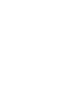 А | 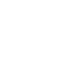 Б | 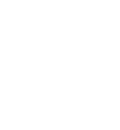 В | 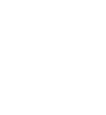 Г 
---|---|---|---
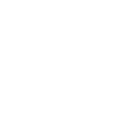 Д | 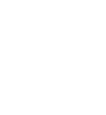 Е, Э | 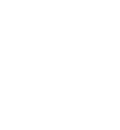 Ж | 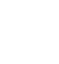 З 
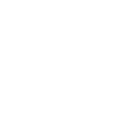 И, Й | 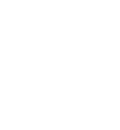 К | 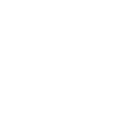 Л | 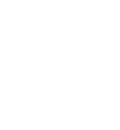 М 
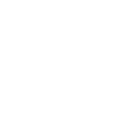 Н | 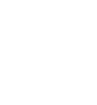 О | 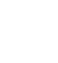 П | 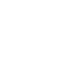 Р 
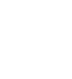 С | 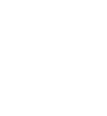 Т | 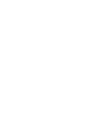 У | 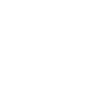 Ф 
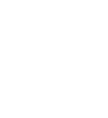 Х | 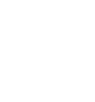 Ц | 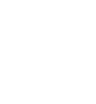 Ч | 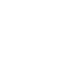 Ш 
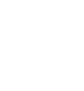 Щ | 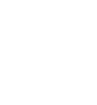 Ъ, Ь | 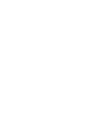 Ы | 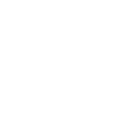 Ю 
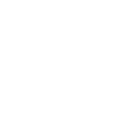 Я |    |    |    
  
  

**Порядок передачи сигналов флагами.**  
Сигналы свода, за исключением показывающих действие корабля, передаются
флажной сигнализацией в следующем порядке:  
\- Флагманский корабль сигналы по соединению передает без позывных адресата и
отправителя; эти сигналы репетуют флагами все корабли соединения;  
\- Флагманский корабль сигналы в адрес одного корабля или нескольких кораблей
передает только с позывными адресата (адресатов); эти сигналы репетуют флагами
корабли, находящиеся на кратчайшем расстоянии между отправителем и адресатом;  
\- Корабли соединения сигналы в адрес одного корабля (в том числе флагманского
) или нескольких кораблей передают с позывными адресата и отправителя; эти
сигналы репетуют флагами корабли, находящиеся на кратчайшем расстоянии между
отправителем и адресатом;  
\- Корабли соединения сигналы, являющиеся донесением флагману и одновременно
оповещением кораблей соединения, передают только со своими позывными; эти
сигналы репетуют флагами все корабли соединения.  
Репетование сигнала.  
Репетование сигналафлагами производится в такой последовательности:  
\- корабль-отправитель поднимает сигнал до места;  
\- корабли, репетующие сигнал, поднимают его же до половины;  
\- корабль-адресат поднимает сигнал до места; вслед за этим корабли,
репетующие сигнал, поднимают его тоже до места.  
Сигнал спускается всеми кораблями, следуя действиям флагманского корабля.  
Порядок передачи сигналов показывающих действия корабля.  
Сигналы показывающие действия корабля, передаются без позывных отправителя и
не репетуются.  
Подъем и спуск флагов расцвечивания.  
При торжественном подъеме Военно-Морского флага России поднимаются стеньговые
флаги и флаги расцвечивания. Стеньговые флаги поднимаются на стеньгах всех
мачт; при этом поднятые на них флаги должностных лиц должны располагаться ниже
стеньговых флагов. Расцвечивание кораблей флагами производится между клотиками
мачт и от последних к штевням корабля. От форштевня до клотика фок-мачты
поднимаются треугольные флаги, между клотиками мачт - прямоугольные, от
клотика, грот- или бизань-мачты к ахтерштевню - треугольные и прямоугольные с
косицами.  
При расцвечивании не употребляются:  
\- Государственный флаг России;  
\- Андреевский флаг;  
\- флаги вспомогательных судов ВМФ и кораблей пограничных войск;  
\- гюйс;  
\- флаги и брейд-вымпелы должностных лиц, вымпел;  
\- иностранные национальные, военные, торговые флаги и флаги должностных лиц;  
\- флаги сигнального комплекта, имеющие одинаковый рисунок с иностранными
национальными флагами; к таким флагам в настоящее время можно отнести флаги:
Б, К, Н, Р, Х, Ц, Э, Исполнительный, 3, 4, 7, 9.  
Набор флагов для подъема при расцвечивании следует производить так, чтобы
поднятые флаги или их отдельные сигналы своими буквенными значениями не
образовывали каких-либо фраз или слов. Флаги расцвечивания поднимаются на
специально приготовленных для этой цели фалах.  
  
**Международный свод сигналов.**  
Международный свод сигналов (МСС) предназначен главным образом для связи с
иностранными кораблями и судами в обстановке, вызванной необходимостью
обеспечения безопасности мореплавания и охраны человеческой жизни на море,
особенно в случаях, когда возникают языковые трудности общения. Свод позволяет
осуществлять сигналопроизводство всеми способами связи, включая радиотелефон и
радиотелеграф. Он построен на принципе, при котором каждый сигнал имеет
завершенное смысловое значение. В отдельных случаях для расширения значения
основного сигнала используются цифровые дополнения. Как правило, одновременно
должен подниматься только один флажный сигнал. Каждый сигнал или группа
сигналов должны оставаться поднятыми до появления ответа на принимающем
корабле

**Вызов судна.**  
Позывные вызываемого судна следует поднимать одновременно с сигналом на
отдельном фале. Если позывные не подняты, то это означает, что сигнал
адресуется всем судам, расположенным в пределах видимости сигналов. Если
невозможно установить позывные судна, которому необходимо передать сигнал, то
следует вначале поднять сигнал VF - "Вы должны поднять ваш позывной" или CS -
"Какое название или какой позывной вашего судна?". Одновременно передающее
судно поднимает свои позывные.  
Ответ на сигналы.  
Все суда, которым адресуются сигналы или которые указываются в сигналах, как
только они их увидят, должны поднять "Ответный вымпел" до половины, а сразу
после разбора сигнала - до места; "Ответный вымпел" должен быть приспущен до
половины, как только передающая станция спустит сигнал, и вновь поднят до
места после разбора следующего сигнала.  
  
**Окончание обмена сигналами**.  
После спуска последнего флажного сигнала передающее судно должно отдельно
поднять "Ответный вымпел", указывающий на то, что этот сигнал последний.
Принимающее судно должно ответить на это так же, как на все другие флажные
сигналы.  
Действия, если сигнал непонятен.  
Если принимающее судно не может различить сигнал, передаваемый для него, то
оно должно держать "Ответный вымпел" поднятым до половины. Если сигнал
различим, но его смысл непонятен, то принимающее судно может поднять сигнал:
ZQ - "Ваш сигнал, по-видимому, закодирован неправильно. Вы должны проверить и
повторить весь сигнал" или ZL - "Ваш сигнал принят, но не понят".  
  
**Использование заменяющих вымпелов.**  
Применение заменяющих вымпелов позволяет повторять тот же буквенный флаг или
цифровой вымпел один или несколько раз в одной и той же группе, если на судне
имеется единственный комплект флагов. Первый заменяющий вымпел всегда
повторяет самый верхний сигнальный флаг первого сигнального сочетания; второй
заменяющий всегда повторяет второй, а третий заменяющий - третий сверху
сигнальный флаг. Заменяющий вымпел никогда не может быть использован более
одного раза в одной и той же группе. "Ответный вымпел", когда он применяется в
качестве знака десятичной дроби, не должен приниматься во внимание при
определении, какой заменяющий следует использовать.  
Передача по буквам.  
Названия судов или географических объектов в тексте флажного сигнала следует
передавать по буквам латинского алфавита.  

* * *

