* * *

**Флаги международного свода сигналов**  
  
К идее передавать сигналы на море с помощью цветных флагов люди пришли
довольно давно. Первоначально смысл флажного сигнала определялся только местом
расположения флага, при этом использовались любые флаги, включая рыцарские
штандарты.  
  
Первые попытки регламентировать и унифицировать флажные сигналы относятся
только к XVII веку. В 1653 году в Великобритании был издан первый сборник
флажных сигналов. Значение сигнала зависело не только от вида флага, но и от
места его подъёма, а также от сопровождения определённой комбинацией парусов
или выстрелами из орудий. В 1780 году (Howe signal book) было решено оставить
в качестве сигнальных флагов лишь 10. Каждая комбинация флагов имела
определённое значение. Чуть позже, в 1800 году, капитан Хоум Риггс Попхэм
(Popham) составил т.н. "Морской словарь", в котором расшифровывались более
2000 флажных сигналов. В 1803 году систему Попхэма принял Королевский Военно-
морской флот.  
  
Но всё это время флажные сигналы оставались прерогативой военных. Лишь в
начале XIX века усилиями Фредерика Марриата был составлен "Кодекс сигналов для
торгового флота". Система состояла из 15 флагов и вымпелов. С помощью неё
можно было передавать слова и целые предложения. Система использовалась только
британцами.  
Со временем возникла необходимость составить аналогичную систему для
международного использования. В 1857 году была разработана "Система кодовых
сигналов для торгового флота" из 18 флагов. Её пользовались уже в Британии,
США, Канаде, Франции. В 1887 году "Система кодовых сигналов для торгового
флота" была переименована в "Международный свод сигналов". Все морские
государства приняли этот свод. Он вступил в силу 1 января 1901 года. В 1931
году международная комиссия из 8 стран модифицировала систему сигналов, сделав
её более удобной. Последняя ревизия Свода состоялась 1 апреля 1969 года. C тех
пор флаги Свода имеют расшифровку и на кириллице.  
Ныне Международный свод сигналов содержит 26 буквенных флагов, 10 цифровых и 3
заменяющих. Для передачи сообщения находят соответствующий текст в своде
сигналов, записывают стоящие напротив ного сигнальные сочетания флагов (бывают
одно-, двух-, трехфлажные сигналы, а также четырехфлажные сигналы,
информирующие о государственной принадлежности судна), набирают их из
сигнальных флагов и поднимают на фалах. Сигнальщик на принимающем судне,
записав эти сочетания, находит их значения в сводах сигналов.  
  
Дальность флажной сигнализации при хорошей видимости достигает 4-5 миль.  
Ниже приведены значения сигналов из одного флага, а также названия флагов и их
соответствие буквам латинского алфавита и кириллицы  

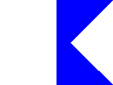 A, Alfa У меня спущен водолаз, держитесь в стороне от меня и следуйте малым ходом.. | 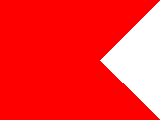 B, Bravo Я гружу, или выгружаю, или имею на борту опасный груз. | 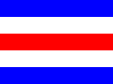 C, Charlie Положитеьный ответ. Значение предыдущей группы должно читаться в утвердительной форме. 
---|---|---
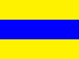 D, Delta Держитесь в стороне от меня, я управляюсь с трудом. | 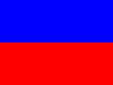 E, Echo Поворачиваю вправо. | 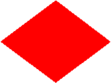 F, Foxtrot Я не управляюсь, держите связь со мной. 
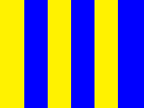 G, Golf Мне нужен лоцман. | 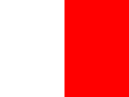 H, Hotel У меня есть на борту лоцман. | 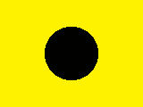 I, India Поворачиваю влево. 
**Сигнал Golf** для рыболовных судов, работающих в непосредственной близости друг от друга означает, я выбираю сети. 
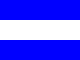 J, У меня пожар и я имею на борту опасный груз, держитесь в стороне от меня | 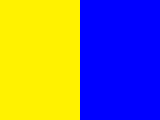 K, Kilo Я хочу установить связь с вами. | 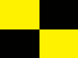 L, Lima Остановите немедленно свое судно. 
**Сигнал Kilo** с цифрой означает, я хочу установить связь: **K2** знаками Морзе с помощью флажков или руками; **K3** усилительным устройством (мегафоном); **K4** светосигнальным устройством; **K5** звукосигнальным устройством; **K6** флагами Международного свода сигналов; **K7** радиотелефоном на частоте 500 кГц; **K8** радиотелефоном на частоте 2182 кГц; **K9** УКВ радиотелефоном по каналу 16. 
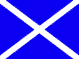 M, Mike Мое судно остановлено и не имеет хода относительно воды. | 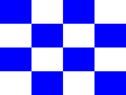 N, November Отрицательный ответ. Значение предыдущей группы должно читаться в отрицательной форме. | 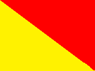 O, Oscar Человек за бортом. 
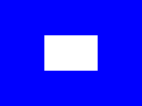 P, Papa **В гавани:** Всем следует быть на борту, так как судно скоро cнимается. **В море:** Мне нужен лоцман. |  Q, Quebec Мое судно незараженное, прошу предоставить мне свободную практику. | 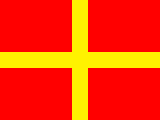 R, Romeo Принято. 
**Сигнал Papa** для рыболовных судов, работающих в непосредственной близости друг от друга означает, мои сети зацепились за препятствие. 
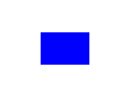 S, Sierra Мои движители работают на задний ход. | 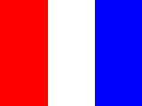 T, Tango Держитесь в стороне от меня, я произвожу парное траление. | 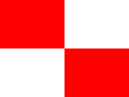 U, Uniform Курс ведет к опасности. 
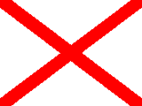 V, Victor Мне необходима помощь. | 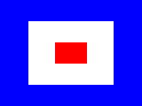 W, Whiskey Мне необходима медицинская помощь. | 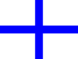 X, X-ray Приостановите выполнение ваших намерений и наблюдайте за моими сигналами. 
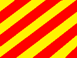 Y, Yankee Меня дрейфует на якоре. | 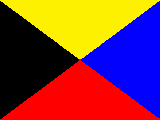 Z, Zulu Мне необходимо буксирное судно |   
  
  

* * *

