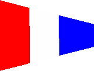
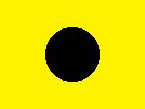

* * *

**Цифровые сигналы**

 1, Unaone |  2, Bissotwo |  3, Terrathree 
---|---|---
 4, Kartefour |  5, Pantafive |   
 6, Soxisix |  7, Setteseven |  8, Oktoeight 
 9, Novenine |  0, Nadazero |   
  
  

**Дополнительные и специальные сигналы**

** 1-й заменяющий** | ** 2-й заменяющий** | ** 3-й заменяющий** 
---|---|---
**Заменяющие вымпелы.**Если на судне имеется единственный комплект флагов, то заменяющие вымпелы позволяют повторить буквенный флаг или цифровой вымпел один или несколько раз: **Первый заменяющий вымпел** всегда повторяет самый верхний сигнальный флаг первого сигнального сочетания; **второй заменяющий вымпел** всегда повторяет второй; **третий заменяющий** \- третий сверху сигнальный флаг. Заменяющий вымпел никогда не может быть использован более одного раза в одной и той же группе. 
  
  

Сигнальные флаги ВМФ Российской Федерации

Специальные сигнальные флаги появились в России в 1696 г. Первый свод
отечественных сигналов был выпущен в 1710 г.  
В СССР существовали 32 буквенных, 10 цифровых флагов, 4 дополнительных и 13
специальных флагов. Эта же система с незначительными изменениями используется
в ВМФ России.

**Буквенные сигналы**

 А, Аз Отрицательный ответ. Не имею. Не разрешаю. Не нуждаюсь. |  Б, Буки Сняться в якоря. Дать самый полный ход. |  В, Веди Курс ведет к опасности. 
---|---|---
 Г, Глаголь Обнаружены корабли противника по пелегну ... градусов, в расстоянии ... каб. |  Д, Добро Положительный ответ. Действовать самомтоятельно или согласно инструкции. Согласен. Разрешаю. Долгота места ... градусов ... минут. |  Е, Есть 
 Ж, Живете Дать средний ход. |  З, Земля Дать задний ход. Дал задний ход. |  И, Иже Общесудовая тревога. Боевая готовность № ... 
 Й, И краткое Обнаружил мину по пеленгу ... градусов, в расстоянии ... каб. |  К, Ка Выхожу из строя (ордера), не следовать за мной. Не могу управиться. |  Л, Люди Поворачиваю влево. 
 М, Мыслете Дать малый ход. Дал малый ход. |  Н, Наш Веду огонь. Гружу боеприпасы (взрывчатые или огнеопасные вещества). |  О, Он Следовать за мной. Прошу. Прошу разрешения ... 
 П, Покой Повернуть вправо на ... градусов. Поворачиваю вправо. |  Р, Рцы |  С, Слово Стоп машины. 
**Флаг Рцы**, поднятый на левом ноке рея означает "дежурный корабль". 
 Т, Твердо Иметь ход ... узлов. |  У, Ухо Тепрлю бедствие, нужна немедленная помощь. |  Ф, Ферт Отмена. 
 Х, Ха Конец учения. |  Ц, Цепочка Возвратиться к своему соединению. |  Ч, Червь Человек за бортом. 
 Ш, Шапка Дать полный ход. Широта места ... градусов ... минут. |  Щ, Ща |  Ъ, Твердый знак. 
 Ы, Еры |  Ь, Мягкий знак. |  Э, Э оборотное 
 Ю, Юла |  Я, Яко Дать самый малый ход. |   
  
  

* * *

