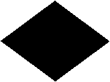

* * *

**Цифровые сигналы**

 1, Единица |  2, Двойка |  3, Тройка 
---|---|---
 4, Четверка |  5, Пятерка |   
 6, Шестерка |  7, Семерка |  8, Восьмерка 
 9, Девятка |  0, Ноль |   
  
  
  
  
**Дополнительные и специальные сигналы**

** 1-й дополнительный** | ** 2-й дополнительный** | ** 3-й дополнительный** 
---|---|---
** 4-й дополнительный** | ** Гюйс** | ** Газ** 
**Гюйс** \-- флаг, поднимаемый и спускаемый ежедневн на носовом флагштоке (гюйсштоке) кораблей 1 и 2 рангов одновременно с военно-морским флагом при стоянке на якоре (на швартовых, бочке). **Гюйс** также является флагом приморских крепостей. 
** Дым** | ** Телеграфный** | ** Шлюпочный** 
** Воздушный** | ** Норд** | ** Зюйд** 
** Ост** | ** Вест** | ** Вопросительный** 
** Ответный** | ** Исполнительный** | ** ** 
**Ответный флаг.** Все суда, которым адресуются сигналы или которые указываются в сигналах, как только они их увидят, должны поднять **ответный флаг** до половины, а сразу после разбора сигнала - до места 
  
  
  
  
**Флаги военно-морского свода сигналов РФ**

** 3-й дополнительный** |   
---|---
В СССР третьим дополнительным флагом был гюйс дореволюционного флота России с
белой каймой. В связи с тем, что в начале 1990-х годов вместе с кормовым
Андреевским флагом был восстановлен и гюйс, был введён новый образец третьего
дополнительного флага - полотнище, поделённое по-диагонали от древка сверху
вниз на белое (вверху) и чёрное (внизу) поля.

**Гюйсы русского и советского ВМФ** 
 1701 - 1924, 1991 - соврем. |  1924 - 1932 |  1932 - 1991 
  
  
* * *

