* * *

**ВОЗДУШНЫЙ ЗМЕЙ. ФЛАГИ-СИГНАЛЫ**

**  
Международная семафорная азбука**  
  
Назову еще одно детское развлечение, призванное служить спасению людей, —
воздушный змей. Раму, сделанную из нескольких тонких дощечек, надо обтянуть
легкой бумагой, тканью или полиэтиленом, и вот уже над лесом парит издалека
заметный воздушный змей. Если к хвосту змея привязать полоски пестрой ткани
или фольги, он станет более заметен.  
Можно также посоветовать возле лагеря, на вершинах отдельно стоящих или
возвышающихся над лесным массивом деревьев, повесить флаги-сигналы, сшитые из
пестрых кусков ткани, из распоротых палаток, одежды.  
Идеальными флагштоками для подобных флагов-сигналов могут служить пункты
государственной геодезической сети, расставленные на расстоянии прямой
видимости (от 2 до 20 км) друг от друга по всей территории страны. Эти
четырехгранные деревянные или металлические вышки имеют высоту до 40 м, и
прикрепленный к ним сигнал будет виден издалека. Кроме того, он даст пилотам
идеальную привязку к местности.  
Хорошо различимы сверху большие оранжевые или пестрые полотнища, растянутые с
помощью длинных веревок над озером или рекой параллельно поверхности воды.
Одна сторона полотнища привязывается к кустам и деревьям, растущим на берегу,
другая — к кольям, вбитым в дно водоема. Над неширокими водоемами ткань
растягивается от одного берега до другого  
  
**Буквенные символы**

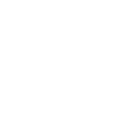 A | 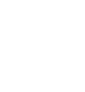 B | 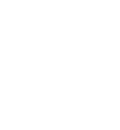 C | 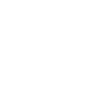 D 
---|---|---|---
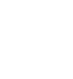 E | 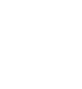 F | 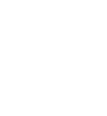 G | 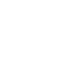 H 
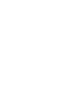 I |  J | 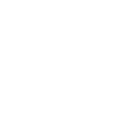 K | 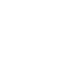 L 
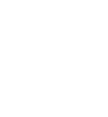 M | 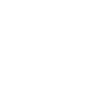 N | 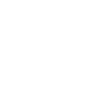 O |  P 
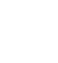 Q | 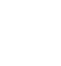 R | 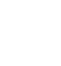 S | 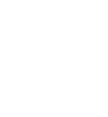 T 
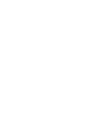 U | 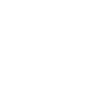 V | 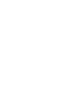 W | 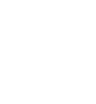 X 
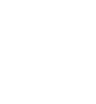 Y | 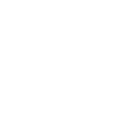 Z |   |   
  
  
**Специальные символы**

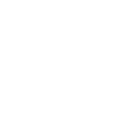 Вызов, Внимание | 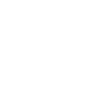 Разделитель 
---|---
  
  
**Знаки телеграфной азбуки**

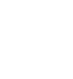 Точка |  Тире | 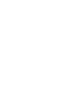 Разделитель между точками и тире |  Разделитель между буквами, группами или словами 
---|---|---|---
 | Если используется передающей стороной - **сигнал ошибки** Если используется принимающей стороной - **просьба повторить** 
  
  

* * *

