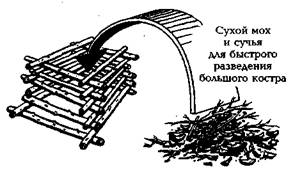
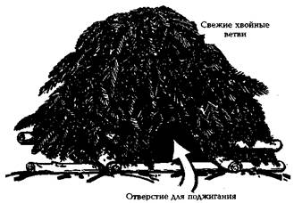
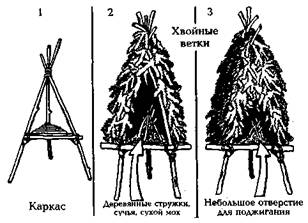
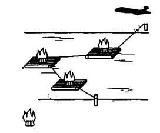

* * *

**  
СИГНАЛЬНЫЙ КОСТЕР**  
  
Даже в самых, казалось бы, безнадежных случаях, когда у потерпевших нет
решительно никакой пиротехники, нет материала для изготовления сигнальных
зеркал и даже ткани на флаги-сигналы, они не беспомощны. У них есть спички и
дрова и, значит, есть возможность разжечь костер.  
Костер — самый простой и, наверное, самый древний способ сигнализации. С
незапамятных времен воины на дальних заставах при приближении врага поджигали
заранее заготовленные вязанки хвороста, и яркий огонь на вершине холма или
столб дыма, поднявшийся в небо, сигнализировал об опасности (рис. 1).  

---

Рис. 1. Принцип подготовки сигнального костра  
Эффективность сигнального костра зависит о места его разведения. Понятно, что
если спрятать костер в лесную чащобу или на дно ущелья, толку от него будет
немного. И наоборот, костер, разложенный на открытой, хорошо просматривающейся
с земли и воздуха местности — высокого голом холме, опушке леса, большой
поляне, без лесном островке посреди водоема, возвышающейся над лесным массивом
скале, — виден издалека Отмечены случаи, когда в ясные, безветренные дни
вертикальные дымовые столбы были различимы на расстоянии, превышающем 50 км!
Правда, и костры эти были соответствующего масштаба .  
  
Лучше приготовить не один костер,  
так как его наблюдатель может принять за случайный,  
а несколько, расположив их в форме какой-нибудь геометрической фигуры.  
На пример, три костра, расположенные друг о друга в трехстах метрах и
образующие треугольник,  
или те же три костра, вытянутые по прямой линии, являются международным
сигналом бедствия.  
А пять костров, расположенных в форме буквы «Т», указывают на место безопасной
посадки.  
Этой буквой размечали посадочные полосы еще партизаны во время Отечественной
войны.  
В любом случае расстояние между кострами должно быть не меньше 30 — 50 м.
Возле каждого костровища необходимо сложить дополнительный запас дров. В
данном случае экономить силы и время не стоит. Пусть лучше пропадут впустую
несколько кубов заготовленных дров, чем в самый ответственный момент для
поддержания огня не отыщется сухого полена. Во время силь­ного снегопада или
дождя костровища и запасные дрова необходимо защитить от намокания, накрыв
куском полиэтиленовой пленки, тканью или толстым слоем елового лапника.  
  
При устройстве сигнального костра в дождливую, ненастную погоду его лучше
сделать двойным. На нижнем ярусе, на высоком дровяном настиле, приготовить
растопку и сухие поленья, а верхний, который должен образовать влагозащитную
крышу, выложить из сухого лапника или из веток деревьев лиственных пород с
подсохшими листьями. При необходимости растопка поджигается и, в свою очередь,
поджигает «крышу». На переувлажненной почве, тем более на болоте, необходимо
соорудить высокий помост, изолирующий топливо костра от влаги (рис. 3).

---
  
  
а) Устройство сигнального костра в ненастную погоду  

---

б) Устройство сигнального костра на переувлажненной почве, на болоте  
Особенно хорошо заметны костры, разложенные на плотах, стоящих на якорях
посреди водоема. Для того, чтобы бревна плотов не загорелись, их сверху надо
выложить камнями или подушкой из земли, дерна, песка. В густолесье, где почти
отсутствуют свободные от деревьев и кустарника пространства, такой способ
костровой сигнализации бывает единственно возможным  

в) Устройство сигнального костра на плотах стоящих на водоеме.  

Рис. 3. Устройство сигнальных костров  
На больших не затянутых лесом полянах, допустимо сооружать сигнальные факелы-
костры. Для этого отдельно стоящее, желательно хвойных пород, дерево под
нижними ветками обкладывается со всех сторон растопкой, которая в момент
прохождения самолета поджигается. Вспыхнувшая крона дерева дает очень мощный,
далеко заметный световой факел. Применяя такой способ аварийной сигнализации,
следует самым тщательным образом соблюдать противопожарную безопасность —
очистить пространство возле дерева от сухой травы и валежника, убедиться, что
даже при самом сильном ветре подхваченные им искры не достигнут лесного
массива. Удобнее всего, когда с подветренной стороны такого дерева-факела
расположен крупный водоем, идеально — если оно растет на лишенном
растительности острове.  
В непосредственной близости от костровищ надо оборудовать круглосуточный
наблюдательный пост, где разжечь и поддерживать постоянный огонь в небольшом
запальном костре.  
  
При появлении самолета, проплывающего по реке или морю судна, любого другого
транспортного средства или людей с помощью углей и горящих поленьев,
вытащенных из «запального» костра, быстро разжигаются большие сигнальные
костры. Сам «запальный» костер в этот момент заваливать дополнительным
топливом не следует, а надо попытаться раздуть пламя или несколькими ударами
по горящим дровам поднять сноп искр.  
  
Одиночный костер рекомендуется периодически прикрывать куском ткани или пучком
лапника, в крайнем случае загораживать своим телом. Прерывистый сигнал
обращает на себя больше внимания, чем постоянный. Таким же способом можно
передавать сигнал бедствия с помощью азбуки Морзе,  
В ясную, солнечную погоду хорошо заметен белый клубящийся дым. Для его
получения в разгоревшийся костер подбрасываются сырые ветки, мох, трава. В
пасмурную погоду лучше виден темный дым — в огонь добавляются зеленые листья,
куски резины, покрышки и камеры от колес автотранспорта, пластик, еловый
лапник, сырой мох, промасленные тряпки. В сомнительных случаях лучше давать
комбинированный сигнал — белый и темный дым от двух близко расположенных друг
к другу костров.  
В пустынной местности для подачи дымового сигнала можно использовать емкости,
наполовину наполненные песком, пропитанным смазочными материалами, соляркой,
бензином. Ночью можно поджигать собранную и связанную в пучки сухую траву,
кустарник.  
  
Ярко горящий в ночи костер пилот пролетающего самолета или вертолета может
заметить за 20 км. При наблюдении с земли костер виден за 8 км. Надо сказать,
неплохая результативность у столь архаичного сигнального средства. Но и тут
свой изъян имеется. Всем хорош сигнальный костер, вот только с собой его нести
сложно.  
На этот случай, прежде чем отправиться в путь, необходимо заготовить несколько
факелов. Кстати, они и от зверя уберечься помогут, и костер под дождем
развести. Чтобы изготовить сигнальный факел, надо с не старой, лучше погибшей,
березы надрать побольше сухой бересты. Свернуть ее в свободный свиток и
насадить на длинную палку. Такой берестяной факел будет гореть очень долго,
давая вокруг себя яркий, ровный свет. Если им размахивать над головой или
периодически закрывать пламя, сигнал будет более заметен. Продолжительность
горения факела и интенсивность свечения зависят от количества бересты, толщины
и плотности свитка.  
  
В крайнем случае в качестве примитивного факела можно использовать пучок из
двух-трех заранее припасенных сухих еловых лап.  
В пустыне факел изготовляется из пустой консервной банки, привязанной к палке
и наполненной песком, пропитанным бензином или соляркой. Днем для получения
густого дыма в банку надо дополнительно плеснуть масла или бросить несколько
небольших кусков резины. Ночью — использовать чистый бензин или другое
горючее, дающее яркое пламя.

* * *

