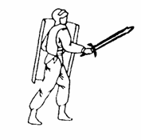
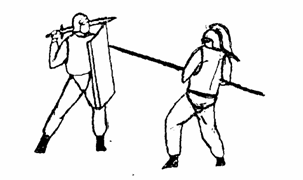

 
Во все времена истории человечества боевые виды спорта служили средством подготовки определенного круга людей. История самозащиты как науки, уходит в далекое прошлое.

Исторические факты свидетельствуют о существовании определенных приемов борьбы еще в далеком прошлом. Древнему Египту Китаю, Индии, Греции, Риму известны были различные приемы самозащиты. Поэтому утверждение, что японцы и китайцы являются создателями первых систем самозащиты без оружия, является не совсем верным.

Единоборства древности
----------------------

В Древнем Египте физические упражнения, в том числе и борьба, существовали издавна. Об этом свидетельствуют изображения на гробницах фараонов и знатных людей того времени. На сохранившихся фресках попадаются рисунки борющихся пар. В одной из гробниц, найдено четыреста рисунков, изображающих в определенной последовательности приемы борьбы.

Боевая физическая подготовка и различные виды боевой борьбы были высоко развиты в древней Греции, в частности, в Спарте и Афинах.

Наиболее ценился рукопашный бой, который, наряду с боем фалангами и колесницами, являлся центральной частью схватки неприятельских войск.

Кроме того, в Греции известны были два вида физических упражнений: палестрика и орхестрика.

Палестрика или «пентатлон» (пятиборье) содержала 5 различных видов упражнений. К «пентатлону» добавлялся у спартанцев панкратион — сочетание кулачного боя с борьбой, в которой разрешалась подножка. А это говорит нам о том, что подготовка должна была вести к одной цели — победить противника любым способом.

Известен был еще просто кулачный бой, где запрещались захваты, и на руки надевались ремни с медными шляпками, с куском свинца или с металлическими кольцами. Удары были кровавыми и опасными. Эти упражнения широко практиковались в целях подготовки к рукопашной схватке.

Орхестрика носила характер игр, развлечений и содержала подготовительные упражнения для развития легкости движений и ловкости.

Из рассказов писателя II века Лукиана из Самосаты — «Об упражнении тела» (изд. Академии наук, Москва, 1975г.) мы можем судить, о том, что методика обучения в греческой школе борьбы строилась в два этапа. Вначале одна сторона старалась хорошо отработать захват, так как противники, натирая кожу маслом, становились скользкими, затем на втором этапе одна сторона тренировалась в уходе с захвата, так как сухому телу (борцы посыпали друг друга песком или золой), было очень трудно освобождаться от сделанного захвата. Кроме того, система греческой борьбы является подтверждением того, что изучаемые приемы в борьбе носили  военно-прикладной характер.

Со сменой географии, не меняется актуальность рукопашной схватки. Так в третьем веке Римское государство, превращается в мощную империю с бесчисленным количеством провинций и колоний. Все это требует от нее большого количества войск для поддержания порядка в своих владениях. Светоний в своей книге «Двенадцать цезарей» (издание Академии Наук, Москва 1973 г.) указывает на широкое развитие в Риме борьбы, как средства физической подготовки воинов.

В основе борьбы были те же правила, как и в панкратионе, т. е. сочетание кулачного боя с борьбой. Она также развивала и готовила бойца для будущих войн. Но особенного расцвета и мастерства искусство рукопашной схватки достигло в гладиаторских школах. Часто бои заканчивалась увечьем или смертью одного из противников.

Рыцарские турниры
-----------------

В последующие века в феодальных государствах Европы, борьба нашла себе применение, как среди рыцарей, так и среди 
простолюдинов.
Одним из методов проверки и демонстрации боевой подготовки рыцарства служили турниры. Во время их проведения рыцари показывали свое умение ездить верхом, плавать, стрелять из лука, бороться, фехтовать и т. д.

Приемы борьбы применялись в схватке вооруженных и не вооруженных противников. Примерно в это время начали складываться родовые школы борьбы.

Уже в позднее время, когда рыцарство пришло в упадок, гражданское население стало создавать свою бытовую оборону, изобретая и перенимая друг у друга, новые приемы самозащиты.
Рассмотрим развитие систем борьбы в отдельных европейских странах.

Бокс
----

В Англии известны были различные стили рукопашного боя. Наиболее распространенными были три направления: вестморлэндское, кумберлэндское и девонширское. Англия, создала и такой замечательный вид боевого искусства как бокс. Первоначально бокс служил средством «выяснения отношений» между джентльменами. Но со временем получив широкое распространение, как в Англии, так и за ее пределами бокс вышел на спортивную арену.

О существовании систем самозащиты в Германии, говориться в книге доктора Фохта «Alte und neune Kaufkunst», выпущенной в Германии, в 1925 году. В этой книге приводятся рисунки найденные в мюнхенской библиотеке и датированные XVII – XVIII веками. На них изображаются бойцы выполняющие различные боевые элементы. 

Во Франции развивались два основные вида самозащиты — французская борьба и французский бокс. Последний под названием «савват» родился на окраинах города, в рабочих кварталах.

Главный принцип французского бокса — это умение наносить удары ногами. Техника ударов ногами во французском боксе была очень виртуозна.

Америка, получила от своих пионеров - колонистов старинную английскую борьбу «Catch-as-catch-can» (от английского глагола catch - хватать). Она представляет один из типов свободной борьбы, в которой  разрешены любые действия: подножки, захваты, броски, удары. Эта борьба, сочетала в себе различные стили, завезенные из Европы, обогатившиеся впоследствии приемами, взятыми у местного населения — американских индейцев.

Восточные единоборства
-----------------------

Касаясь английской, американской и французской борьбы, было бы несправедливо обойти молчанием системы специальной физической подготовки, практикуемые в Японии.

**Джиу-джитсу** — более старинная система, Дзюдо, Айкидо, Каратэ,— более поздние и более усовершенствованные для спортивных состязаний, системы физической подготовки. В системе Джиу-джитсу имеется раздел боевых приемов, которые фигурируют под этим же названием, как система самозащиты.

Из истории Японии известно, что приемы, похожие на приемы Джиу-джитсу, использовались при обучении боевому искусству самураев, и применялись как во время ведения войн, так и во время игр.

Дзюдо возникло на базе Джиу-джитсу (Дзю-дзюцу). Основателем современного Дзюдо считается профессор Дзигаро Кано, родившийся в 1860 году в городе Микагэ.

В короткий срок, Кано сумел освоить технику Дзю-дзюцу. Выбрав и исключив из нее наиболее опасные захваты и удары, он создал новую систему физического совершенствования.
Первая школа Дзюдо – Кадокан, была открыта при буддистском храме Эйсе в Токио в 1882 году. В1883 году в Дзюдо была введена разрядная система, а в 1900 году -  судейские правила соревнований.  В 1911 году Д. Кано основал Японскую спортивную ассоциацию, став ее президентом.

Дзюдо делится на спортивное Дзюдо и военно-прикладное Дзюдо,

Спортивное Дзюдо имеет в основном следующие разделы:

* подготовительные упражнения,
* передвижения, взаиморасположения, захваты
* приемы борьбы:

    * стоя
    * в партере

Военно-прикладное «Дзюдо» делится на борьбу:

* против соперника, вооруженного холодным оружием;
* против соперника, вооруженного огнестрельным оружием;

История айкидо
--------------

Интересно, что одной из причин, превративших Страну восходящего солнца в высокоразвитую мировую державу, сами японцы считают возрождение и широкую популярность своих боевых искусств в конце 40-х годов. Их дух помог пережить поражения во второй мировой войне. Недаром родоначальник айкидо Морихей Уэсиба, получил правительственную награду за оздоровление нравственности нации вследствие массового распространения этой борьбы.

Ознакомившись с зарождением и развитием основных боевых систем Востока и Запада, мы подходим к рассмотрению боевых традиций существовавших на территории России.

Россия испокон веков славилась удалью и непобедимостью в рукопашной схватке. Исторические источники описывают это так: «Бои кулачные и палочные составляли для русской молодежи потеху, увеселение. Бои проходили, обыкновенно, в праздничные дни, при жилых местах, «охотники» составляли два лагеря и по данному сигналу бросались один на другого с криком для возбуждения, тут же били в накры и бубны (музыкальные инструменты) играли на гуслях и свирелях. Борцы поражали друг друга в грудь, лицо, живот — бросались неистово и жестоко».