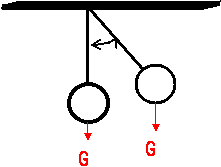
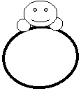
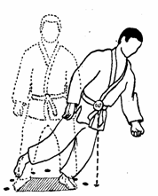
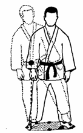
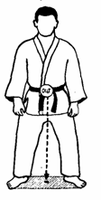
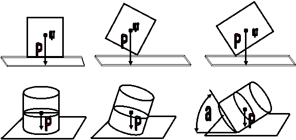
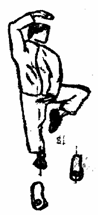
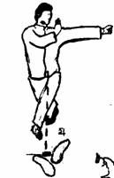
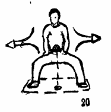
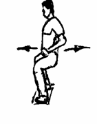

При выведении противника из состояния равновесия, бойцу необходимо четко представлять в каких случаях тело будет находиться в устойчивом, ограниченно устойчивом, безразличном и неустойчивом состоянии.

1. УСТОЙЧИВОЕ - такое состояние, при котором выведенное под действием сил тело, возвращается в прежнее положение.

    Примерами в данном случае могут являться: маятник, гимнаст на перекладине, кукла - неваляшка

    
    

    Для человеческого тела, самым устойчивым состоянием на опоре, будет положение лежа на животе, расставив в     стороны руки и ноги, тогда тело имеет самую большую площадь опоры.

2. ОГРАНИЧЕННО УСТОЙЧИВОЕ - имеется предельный угол устойчивости тела
    Предельный угол устойчивости тела это угол, образованный линией проекции силы тяжести, проведенной из точки общего центра масс тела и линией проведенной из этой же точки (центра масс) до края плоскости опоры.

3. БЕЗРАЗЛИЧНОЕ – точка опоры находится на одной линии с проекцией силы тяжести Примером в данном случае может служить бильярдный шар.

4. НЕУСТОЙЧИВОЕ –Центр тяжести находится за площадью опоры, тело под действием силы и силы притяжения стремится вниз.

    
    
    

    α – предельный угол устойчивости тела

    

    Самое неустойчивое состоянием человеческого тела на опоре, - положение на носке или на пятке, стоя на одной ноге. Относительно стоек, самая неустойчивая – ноги вместе, колени прямые.

    Поэтому многие положения из восточных боевых искусств, в реальной схватке, становятся не только не удобными, но и опасными.

    
    

    Рис. стопы , рисунок из кун-фу

    Таким образом, человеческому телу при выводе из равновесия нужно сообщить какую-то внешнюю силу, которая могла бы вывести центр тяжести тела за площадь опоры.

    Площадь опоры бойца ограничена внешним краем стопы.

    Площадью опоры бойца в основной стойке, является площадь заключенная между линиями, которые соединяют носки и пятки ног и ограниченна внешним краем стопы.

    **Расстояние между стопами равно приблизительно ¼ человеческого роста, на практике, для простоты, это расстояние будет определяться шириной плеч.**

    С увеличением роста (высоты тела), для сохранения устойчивости необходимо увеличивать площадь опоры.

    Непропорциональное увеличение площади опоры, расширение ее за основную стойку, относительно высоты тела, ведет к ограничению подвижности бойца и к снижению устойчивости, а следовательно негативно влияет на его технические возможности и на возможности сохранения равновесия

    На нижеприведенном рисунке показано влияние стойки на устойчивость бойца. Широкие стрелки показывают направления повышения устойчивости, тонкими стрелками показано направление снижения устойчивости рукопашника.

    
    

    Рис. стопы , рисунок из кун-фу

    **Учитывая то, что все органы и части человеческого тела имеют свой центр тяжести, применительно к рукопашному бою, в первую очередь будем рассматривать общий (анатомический) центр тяжести, который как принято считать, находится в области живота. Высота его расположения является одним из факторов устойчивого положения тела в пространстве.**