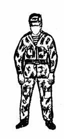
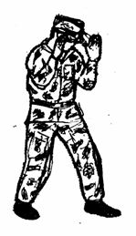
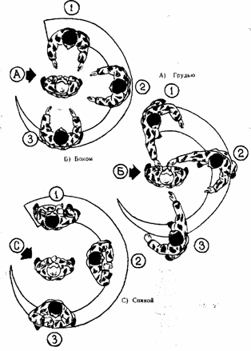
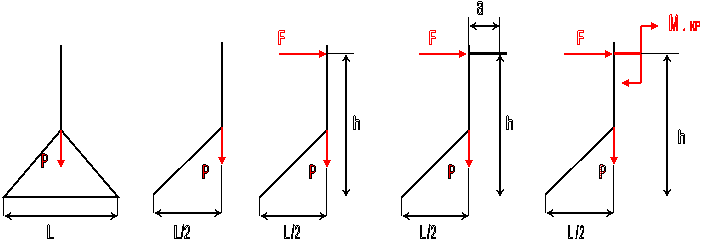

На важность положения проекции центра тяжести относительно площади опоры, указывают стойки бойца.
Боец находится в свободной (а) и боевой (б) стойке.

  

Рис. а

Рис. б

Рассматривая стойки рукопашника, необходимо отметить, что положения тела в пространстве во время схватки могут быть самые различные. Это зависит как от интеллектуальных способностей бойца, его физической подготовленности, гибкости его суставов, пластичности связок, так и от окружающих условий выполнения тех или иных задач. Поэтому нет необходимости строго указывать возможные положения тела бойца в стойке.

Целесообразнее указать взаиморасположения тел бойцов в процессе непосредственного контакта во время рукопашной схватки.

Три положения по отношению к противнику: лицом, боком, спиной – образуют взаиморасположения в стойке, различные положения тел бойцов в партере - образуют взаиморасположения в партере.                                                     

При перемещении бойца в пространстве, не зависимо от того, происходит это в процессе боевого столкновения, или это простое перемещение, центр тяжести изменяет свое положение по высоте, а его проекция постоянно меняет свое положение в плоскости опоры.

Одним из факторов влияющих на устойчивое состояние, является вес тела. Если тело с большим весом, находится в неподвижном (статическом) состоянии, за счет силы тяжести и силы сцепления с поверхностью опоры, устойчивость повышается. Однако, как только боец с большой массой тела, начинает перемещаться, происходит обратный эффект. При резком торможении или изменении направления, тело приобретает бо'льшую силу инерции. В следствии чего, бойцу становится практически невозможно управлять своим телом. Это ведет к ограничению технического потенциала и нарушению устойчивости.

Так же на устойчивость оказывает влияние гибкость суставов, от которой зависит плавность движений. В особенности на это влияет гибкость суставов ног (голеностопный, коленный, тазобедренный) и позвоночник. Гибкий позвоночник, необходимо больше вращать и перегибать, что бы добиться нарушения равновесия.

В связи с тем, что за координацию человеческого тела в пространстве, отвечает вестибулярный аппарат, вертикальное положение головы, является оптимальным для обеспечения устойчивого положения тела бойца. Наклон головы в ту или иную сторону, влечет за собой повышение или снижение тонуса различных групп мышц, что оказывает, хотя и в меньшей степени, влияние на устойчивость.

Дыхание на первый взгляд, не оказывает влияние на устойчивость человеческого тела. Однако при вдохе, внутренние органы несколько смещаются вверх, вследствие чего, смещается вверх и анатомический центр тяжести, что снижает устойчивость. Мышцы более длительное время будут реагировать на восстановление положения тела при вдохе, поскольку в этот момент они расслабляются. В связи с этим, атаку противника целесообразнее принимать на выдохе, во время работы дыхание не задерживать, поскольку это влечет нарушение анаэробные газо-обменные процессы, контратаку проводить на выдохе, в момент вдоха противника.

Необходимо так же отметить, что общее самочувствие оказывая влияние на скорость нервно – мышечных реакций и на мышечную чувствительность в целом, тем самым, оказывая влияние на контроль вестибулярного аппарата за положением частей тала в пространстве. А поскольку анатомические особенности вестибулярного аппарата строго ориентированны относительно общего центра тяжести, следовательно и общее самочувствие влияет на устойчивое положение тела в пространстве.

 Кроме того, с целью минимизации усилий при выведении противника из состояния равновесия. его телу можно (и нужно) придать вращательное движение во всех трех    плоскостях. Оно задается за счет приложения пар сил через систему рычагов.Из курса теоретической механики  мы узнаем, что парой сил называются две одинаковые по  величине и  противоположные по направлению, параллельные силы, приложенные к одному телу. Кратчайшее расстояние  между  линиями действия сил,  образующих пару сил, называется  плечом пары сил. Действие пары сил на тело, характеризуется моментом пары сил – произведением одной из сил на плечо.

 Схематично, минимизацию усилий при выведении из равновесия с точки зрения биомеханики, можно выразить следующим образом:

 