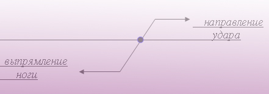

Из всего вышесказанного об устойчивости, с токи зрения ее нарушения, можно сделать выводы о том, что основополагающими в процессе выведения из равновесия тела бойца во время схватки будут:

1. Площадь опоры (либо мала,  либо расположена на разных уровнях).

2. Величина расстояния между центром тяжести и площадью опоры.

3. Величины предельного угла отклонения.

4. Величины и степени вращения центра тяжести в трех плоскостях.

5. Степени напряженности человеческого тела, т. е. чем сильнее напряжено тело в торсе, тем легче изменять предельный угол отклонения, что ведет к нарушению равновесия.

Не менее важную роль в минимизации энергетических затрат в процессе рукопашной схватки, играет знание биологически активных и болевых точек человеческого организма.

Уметь вывести противника из состояния равновесия, воздействуя на его чувствительные места, позволяет нам значительно снизить затрачиваемые усилия. Так, например, выводя противника из равновесия с помощью пары сил (см. рис. ...), прикладываем одну силу к руке противника, вторую - параллельную, и противоположную ей по направлению, с целью облегчения своей работы, направляем на шею в область большого треугольника поражая блуждающий нерв.

Для изучения топографии болевых точек человеческого организма ниже приводится примерная схема расположения наиболее чувствительных мест на теле человека.

Воздействовать на данные токи можно различными способами. К ним относятся: удары, различного рода сжатия и нажатия, всеми вышеперечисленными способами при помощи подручных предметов.

## Удары

Мы знаем из физики, что ударом называется мгновенное воздействие силы и сила эта действует в связи с временем скорости и пути прохождения предмета, которым наносится удар на то или иное сопротивление (тело, мышцы и т. д.).

Удар характеризуется временем соприкосновения. Если время соприкосновения меньше 100 миллисекунд, - это удар, если больше, - перемещение.

Степень **упругого удара** оценивается коэффициентом восстановления.

**Центральный удар** - такое взаимодействие тел, при котором направление действующей силы проходит через точку центра масс тела. В этом случае происходит линейное перемещение тела, относительно действующей силы.

**Косой удар**. При нецентральном ударе направление и точка действия силы обязательно не проходит через точку центра масс тела. При этом возникает момент силы равный произведению величины силы на диаметр, в результате которого происходит вращательное движение относительно точки центра масс.

В рукопашном бою существуют различные виды ударов, у них свои законы и правила. У системе А. А. Кадочникова кроме общепринятых, применяемых всеми ударов, существуют три вида ударов кулаком в цель, имеющие свою специфику технического выполнения:

1. Проникающий

2. Смазывающий

3. Вибрационный

### 1. Проникающий

Это когда наносится очень сильный прямой удар кулаком в цель, с мощным движением (с шагом) тела вперед. Удар, как правило, проводится на поражение. В этом случае удар усиливается за счет резкого выпрямления толчковой ноги и подачи вперед плеча бьющей руки

### 2. Смазывающий

Это очень сильный, хлесткий и закручивающий удар кулаком. Ценность этого удара в том, что после него не бывает травм руки. Если в первом варианте могут быть травмы от перегрузки удара, то в данном случае распределение энергии удара будет не в обратно поступательной ответной силе и отдаче в руку, а скользяще размазывающее. Что и сохранит руку, а распределение ударной волны в цель будет нарастающей. Этим ударом при определенной тренировке можно поражать одновременно нескольких противников. Быстрое, непроизвольное возвращение своей руки в обратное исходное положение (боевой стойки) позволяет мгновенно переключаться на другие атакующие действия. Удар этот очень экономичен, потому что выполняется на полном расслаблении организма, бесконтрольно и без концентрированной фиксации кулака в конечной его фазе.

### 3. Вибрационный

Это когда за одним ударом следуют импульсивные мощные толчки вдогонку. Успех такого удара зависит от умения мгновенно переключаться от напряжения к расслаблению мышц тела и руки. Тут наблюдается принцип отбойного молотка. При этом можно, кстати, эффективно освобождаться от сильных захватов.

--------------
 
С анатомической точки зрения, удар — это мгновенное воздействие силы на ту или иную часть тела, где происходит механическое раздражение нервных путей, проходящих между и внутри мышц, связок, костей, а также повреждение мелких и крупных сосудов, что ведет к кровоизлияниям. Отсюда понятно, что группа приемов — ударов представляет большую опасность для человеческого организма. При ударе могут  происходить следующие анатомо-физиологические нарушения стабильного функционирования организма.

1. Удары действуют непосредственно на нервы, нервные узлы или сплетения, результатом чего бывает нервный шок.

2. Удары, действующие вначале на мышцы или связки, окружающие эти нервы, вызывают болевые ощущения.

3. Удары, производящие механический разрыв мышц, сосудов, перелом костей и другие нарушения рабочего состояния организма.

Поэтому понятно, что если мы хотим получить наибольший эффект от наших действий — ударов, то надо произвести удар в такое место, где нервы, сосуды и кости менее защищены мышцами, плотными сумками и связками, и где они наиболее близко подходят к поверхности человеческого тела.