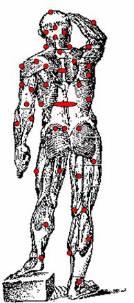
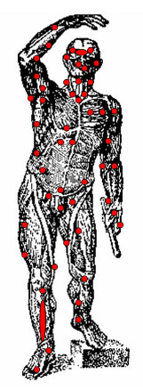

## Примерная схема расположения болевых точек на теле человека

Такими чувствительными точками являются:  ОПИСАНИЕ СХЕМЫ СВЕРХУ ВНИЗ

 
а) солнечное сплетение;
б) промежность;
в) верхний угол нижней челюсти — шейная ветвь лицевого нерва;
г) наружная сторона шеи по шейному нервному сплетению, находящемуся на передней боковой стороне шеи;
д) адамово яблоко;
е) удар в пах;
ж) нижняя часть колена (на 2 см. ниже коленной чашечки) в нерв;
з) голеностопный сустав;
и) под колено (с задней части колена);
к) удар в почки на уровне 11, 12 ребра;
л) удар под локоть по локтевому нерву;
м) удар в печень (в правую часть тела) немного ниже диафрагмы;
н) удар открытой ладонью, сложенной в виде чашечки, по уху (пневматическое воздействие воздухом, который, будучи в переднем слуховом проходе, от резкого удара сжимается и с силой устремляется в ушную перепонку, в результате чего происходит нарушение целости ушной перепонки и бессознательное состояние потерпевшего.
о) удар пальцами в глаза
р) заушная впадина

### СЖАТИЯ И НАЖАТИЯ

Сжатие — это механическое воздействие силы с двух сторон на мышцы, внутренности, нервы, связки и кровеносные сосуды.
Нажатие есть механическое воздействие силы с одной стороны на мышцы, внутренности, нервы, связки и кровеносные сосуды. И сжатие и нажатие производят механическое нарушение в правильном функционировании той части тела, на которую оказывается воздействие. Это механическое воздействие силы иногда переходит в травму: например, при «ножницах» (боковых) происходит сильное растяжение межреберных мышц, вогнутое положение ребер и нарушение работы во внутренних органах (затруднительное дыхание, переломы ребер и т. д.). Сжатия и нажатия целесообразно проводить на лимфатические узлы или определенные мышцы или на места близкого расположения к поверхности нервно – сосудистых пучков. Например: нажатие на нервно – сосудистый пучок расположенный с правой и с левой стороны на сгибе локтя или колена, сжатие грудино-ключично-сосцевидной мышцы.
 
Болевые воздействия на уязвимые токи, при помощи захватов, нажимов, ущемления, выкручивания выполняют задачи по сковыванию действий противника или по освобождению из-под его контроля в ближнем бою.

## Дистанция

В тактике ведения рукопашной схватки важную роль играет умение удерживать нужную дистанцию, быстро передвигаться и вовремя контратаковать. Дистанция выбирается в зависимости от тактики боя и технической оснащенности. Делая разграничения видов рукопашного боя на рукопашный бой с оружием (холодным и огнестрельным) и рукопашный бой без оружия, Алексей Алексеевич, определяет для каждого вида три дистанции. Ближнюю, среднюю и дальнюю.