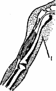
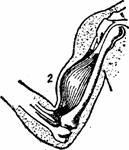
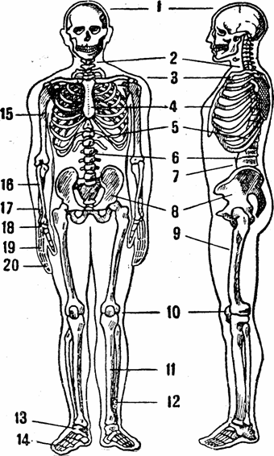

Двигательная система человека состоит из двух частей:

- опорная (пассивная) — скелет (подробно см. рис)
- двигательного аппарата (активная).

1. Опорная или пассивная часть двигательного аппарата называется потому, что она сама по себе не может изменять положение частей и всего тела в пространстве. Она состоит из костного скелета, составные части которого взаимно связаны между собой связочным аппаратом и мышцами.

Эта система служит опорой телу. Кости скелета построены из крепкой костной ткани, состоящей из органических веществ и солей, снаружи покрыты надкостницей, через которую проходят кровеносные сосуды, питающие кость.
 
По форме кости бывают: длинные, короткие, трубчатые, плоские, смешанные.

 1. Длинные – выполняют функцию рычагов 
 2. Короткие (губчатые) – располагаются в соединениях между костями
 3. Плоские (широкие) – функция защиты, участвуют в образовании полостей
 4. Смешанные (мемориальные)

2.Активная часть или двигательный аппарат. Мускулатура скелета состоит из большого числа отдельных мышц, которые в свою очередь состоят из мышечных волокон. Мышечная ткань, обладает свойством сокращаться (укорачиваться по длине) под влиянием раздражения, поступающего к мышцам от центральной нервной системы. Мышцы, крепящиеся своими концами к костям, чаще, с помощью сухожилий — при своем сокращении сгибают, разгибают и вращают эти кости (рис. ....). Таким образом, сокращения мышц и образующаяся при этом мышечная тяга является силой, приводящей в движение части нашего тела.

Работа мышц руки (сгибатель) в состоянии: 1 - покоя, 2- сокращение.
 
Соединение костей между собой называется суставами. Все они одеты суставной сумкой, состоящей из плотной соединительной ткани. Концы костей в местах соединения покрыты гладким хрящем и укреплены суставными связками. Организация движения в суставах, обусловлена формой или видом сустава.
Суставы являются для бойца одним из самыми уязвимыми местами, так как плотная соединительная ткань, образующая суставные связки и сумку, обладает сравнительно малой упругостью.
Укрепление связочного аппарата так же важно, как и развитие самих мышц, и достигается постоянной тренировкой и специальными физическими упражнениями (статическая нагрузка укрепляет связочный аппарат, динамическая нагрузка – мышцы).
Рассмотрим опорную часть двигательного аппарата — скелет.
 
1. Скелет туловища
Скелет туловища состоит из позвоночника, грудной клетки, костей плечевого пояса и костей тазового пояса.
Основой скелета туловища является позвоночник.
 
Его шейный отдел состоит из 7 позвонков, грудной — из 12 позвонков, поясничный — из 5 позвонков, крестцовый — из 5 позвонков, копчик из 4—5 позвонков. Имеющиеся в позвонках отверстия образуют в позвоночнике канал. В нем находится спинной мозг, являющийся продол­жением головного мозга.
 
Подвижной частью позвоночника является его шейный и поясничный отдел. В позвоночнике имеется 4 изгиба: вперед — в шейной и поясничной частях и назад — в грудной и крестцовой части (лордоз и кифоз).
 
Эти изгибы вместе с лежащими между позвонками хрящевыми дисками служат амортизирующим средством при толчках, беге, прыжках и т.д.
В грудной клетке находятся легкие, дыхательные пути, сердце, крупные кровеносные сосуды и пищевод.
 
Грудная клетка образована грудными позвонками, 12-ю парами ребер и грудиной. Ребра прикрепляются к позвонкам, в соединении с грудной костью хрящами, что обеспечивает экскурсию на вдохе и выдохе. Последние два ряда ребер имеют только одно прикрепление, а передние их концы свободны.
 
Грудная клетка, благодаря особой форме суставов между ребрами и позвонками, может изменить свой объем при дыхании: увеличиваться в объеме при поднимании ребер кверху и уменьшаться при их опускании книзу. Расширение и уменьшение объема грудной клетки происходит благодаря действию так называемых дыхательных мышц, прикрепленных к ребрам и диафрагме. Подвижность грудной клетки в значительной мере определяет работоспособность органов дыхания и важна при высокой физической нагрузке, когда необходимо глубокое дыхание.
 
Скелет плечевого пояса состоит из ключиц и лопаток. Ключица одним своим концом соединена малоподвижным суставом с грудиной, а другим с лопаткой.
Лопатка — плоская кость — свободно лежит сзади на ребрах, вернее на мышцах, и покрыта мышцами. К лопатке прикрепляется ряд крупных мышц спины, которые при своем сокращении закрепляют лопатку, создавая в нужных случаях полную неподвижность ее, необходимую при сопротивлении. Отросток лопатки образует с шарообразной головкой плечевой кости сустав, который называется плечевым.
 
Благодаря мало подвижному соединению ключицы с грудиной и устройству плечевого сустава, рука имеет возможность производить самые разнообразные движения.
Таз образован крестцом, двумя подвздошными костями. Кости таза плотно соединены между собой и с позвоночником, так как таз служит опорой для всех вышележащих частей тела.
 

 
Рис.2 Скелет человека.

 1—череп; 2—шейные позвонки; 3—ключица; 4—грудная кость; 5—грудные позвонки;

6—межпозвоночные хрящи; 7—поясничные позвонки; 8—таз; 9—бедренная кость; 10—коленный сустав; 11—большая берцовая кость; 12—малая берцовая кость; 13—кости плюсны; 14—фаланги; 15—плечевая кость; 16—лучевая кость; 17—локтевая кость; 18—запястье; 19—пясть; 20—фаланги.
 
