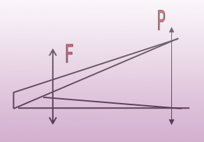
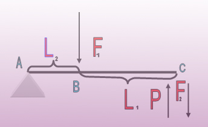
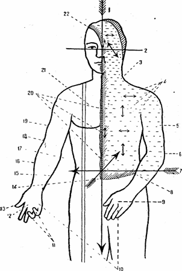

Рычаги третьего рода ''пинцет'' .
Рычаг скорости

F2/F1=L2/L1

P<F1,  P>F2; необходимое условие для увеличения скорости.

К рычагам третьего рода относится такой случай расположения указанных трех точек, когда действующая сила Р помещается между сопротивлением R и точкой опоры А.
В этом случае плечо сопротивления AR предполагается всегда длиннее плеча действующей силы, что благоприятствует развитию скорости точки R в ущерб к приложенной силе. Все сгибательные мышцы действуют в условиях такого рычага. Поэтому технические действия этого раздела построены по принципу сгибания, например, дожимы.
Но независимо от рычагов, описанных выше, мы можем наблюдать быстрое перемещение и порядка рычагов всех видов, потому что ни одна из частей двигательного аппарата не фиксирована в статике, а все мышцы в той или иной мере участвуют в движении, сопротивлении и т. д.. Сама опорная точка, которую мы только для данного и определенного движения считаем опорной, не является неподвижной, поэтому места приложения сил также не вполне постоянны и не связаны с одним каким-либо пунктом кости. Такое явление мы может наблюдать в 'технических действиях, где имеется положение шнека (скручивание). Кроме того, для лучшего усвоения материала, нужно учесть один очень важный принцип биомеханики: при сокращении мышц, разгибатели развивают максимум силы (напряжение) в начале своего сокращения, в то время как сгибатели — в конце. Это значит, что против разгибателей воздействие проводится быстрее, чем при работе против сгибателей.

 
2. Плоскости, оси суставов в человеческом теле

Человеческое тело движется в разнообразных направлениях. Само движение подчинено основным правилам. Они выражены в изучении условно обозначенных осей и плоскостей движения человеческого тела.
Учитывая трех мерность нашего пространства, в рукопашном бое рассматриваются три плоскости:
а) горизонтальная),
б) фронтальная,
в) сагиттальная 
Оси человеческого тела:
1. Вертикальная ось.
2. Поперечная ось.
3. Фронтальная плоскость (одна из фронтальных)
5. Плечо, приведенное к туловищу (приведение плеча).
6. Левая рука согнута в локте предплечья.
7. Поперечная ось.
8. Поперечная плоскость (одна из горизонтальных).
9. Кисть в положении пронации; большой палец обращен к туловищу (ладонь кисти смотрит вниз).
10. Перемещение положения из пронации к супинации есть пример вращения кисти.
11. IV—V пальцы согнуты (сгибанив)  .
12. Кисть в положении супинации; большой палец обращен кнаружи от туловища (ладонь кисти смотрит вверх).
13. Большой палец отведен (отведение пальца).
14. Сагиттальная ось.
15. Медиальный внутренний край.
16. Латеральный наружный край.
17. Поперечная ось, одна из горизонтальных, лежащая во фронтальной плоскости.
18. Правая рука разогнута в локте (предплечья).
19. Вся рука отведена от туловища (отведение руки).
20. Линии, лежащие в сагиттальной плоскости; горизонтальные и вертикальные.
21. Латеральная (наружная) плоскость по отношению к медиальной (одна из сагиттальных).
22. Средняя плоскость, плоскость симметрии (одна из сагиттальных).
 
а)Горизонтальная плоскость.
 
Плоскость, проходящая через левую и правую стороны живота. Плоскость, укладывающаяся с линией горизонта. Горизонтальная плоскость мысленно рассекает тело в положении стоя параллельно земле на бесчисленные части.
Тело в этой плоскости может двигаться вперед, назад
б)Фронтальная плоскость.
 
Вращение тела вокруг продольной оси, вокруг оси фронтальной плоскости. Эта плоскость проходит через левое и правое ухо и левую и правую половину живота и отделяет переднюю часть тела от задней.
Движение во фронтальной плоскости обычно бывает при рывках тела в сторону, вращение тела при ходьбе (начало вывода из равновесия и т, д. ).
 
в) Сагиттальная плоскость.
 
Сагиттальная плоскость проходит через переднюю и заднюю стенки туловища в направлении: кончика носа, пупка, лобка, к средней линии спины, делящей туловище пополам, отделяет правую половину тела от левой. В этой плоскости бывает движение характера «рывка, толчка в обратную сторону».
Все вышеуказанные плоскости взаимно перпендикулярны, а поэтому движения могут переходить из одной плоскости в другую. Линии, указывающие направления — вертикальная, поперечная и сагиттальная, являются одновременно осями этих плоскостей, вокруг которых происходят соответствующие движения.
Вокруг вертикальной (продольной) оси, проходящей через туловище (от макушки до поверхности опоры), туловище вращается в правую и левую сторону. Конечности вокруг оси, проходящей по ним, могут поворачиваться наружу или внутрь.
Вокруг фронтальной оси выполняются сгибания и разгибания
Вокруг сагиттальной оси тело делает наклон вправо и влево, выполняется приведение , отведение.
Чтобы точно понимать — что такое оси движения, мы должны анатомо–физиологическую классификацию суставов.
 
1.      Одноосные суставы.
2.      Двуосные суставы.
3.      Многоосные суставы.
 
По форме суставных поверхностей:
 
1.      Цилиндрический  (разновидность – блоковидный)
2.      Эллипсоидный
3.      Шаровидный  (разновидность – чашеобразный и плоский)
 
Форма суставных поверхностей, определяет число осей, вокруг которых происходит движение в данном суставе.

