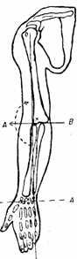
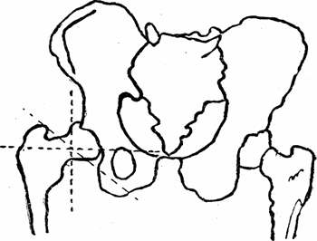

## 1. Одноосные суставы.
 
В одноосных суставах движения совершаются вокруг одной оси. Причем форма сустава всегда цилиндрическая, так как цилиндр имеет одну основную ось и в зависимости от расположения сустава последние бывают с поперечной и продольными осями.

* Суставы с поперечной осью .
Ось вращения в данном суставе располагается поперечно к длине оси сочленяющихся костей, например: ось АВ локтевого сустава. По данной оси происходит нормальное движение выше обозначенных суставов.
* Суставы с продольной осью.
Эти суставы в большинстве носят название вращательных ибо ось движения расположена вдоль длины костей и совпадает с продольной осью кости. Примером может служить сочленение — сустав между лок­тевой и плечевой костями в предплечье. Ось этого сустава обозначена на рис. № 12 буквами fc, вокруг которой и происходит вращение предп­лечья вовнутрь и кнаружи.

## 2. Двуосные суставы.

 
Двуосными суставами называются такие суставы, которые имеют две главные оси, несмотря на то, что кроме движений по этим двум осям возможны второстепенные движения по осям, расположенным в сфере этих двух главных осей. По своей форме построения суставы, имеющие две главные оси, делятся на эллипсоидные, седловидные и мыщелковидные.
 
* Эллипсоидный сустав по форме похож на эллипсоид (яйцо). В суставе таком возможны сгибание и разгибание, приведение и отведение, а также смещение суставных поверхностей в отношении друг к другу, кроме того, путем комбинаций возможны вращения вокруг опорной точки. Типичным представителем таких суставом является лучезапястный сустав (см. рис. № 12cd).
 
* Седловидный сустав образован сферической поверхностью, которая вогнута в одном направлении и выпукла в другом, перпендикулярны к первому, напоминая собой седло с передней и задней лукой. Соответственно такая же другая поверхность выпуклая в обратном отношении, что обусловливает собой возможность смещения одной кости по отношению к другой, главным образом, в двух взаимно перпендикулярных направлениях, хотя здесь также возможно, при комбинации движений, вращение вокруг опорной точки. Примером может служить пястно-запястный сустав большого пальца с возможными в нем движениями — проведение и отведение этого пальца.
 
* Мыщелковидный сустав – выпуклая суставная поверхность всегда расположена на выступающем округлом отростке (мыщелке). Движение осуществляется вокруг двух осей: это коленный сустав (вокруг фронтальной – сгибание и разгибание, вокруг продольной – вращение). Это переходная форма от блоковидного к эллипсоидному.
 
 
 
## 3. Многоосные суставы
 
1.   К данному виду суставов относятся суставы, имеющие форму шара, т. е. такую форму, при которой возможно большее количество осей движений. Но в сочленениях многоосных суставов бывает двоякого характера различия, это — шаровидный и ореховидный суставы. Шаровидный сустав имеет ямку сочленения, куда вставляется сустав соответствующего ему 1/3 всей поверхности, тогда как суставная поверхность ямки ореховидного сустава глубока, да еще при посредстве добавочной суставной сумки охватывает головку больше, чем наполовину.
 
Поэтому такое расположение суставных ямок многоосных суставов дает особый характер движений. Ясно, что чем глубже сустав сидит в суставной ямке, тем больше ограничений движений в этом суставе, этим отличается ореховидный сустав. В данных суставах, как и геометрической фигуре, шар имеет три главных оси: вертикальную, поперечную и сагиттальную оси, идущие спереди назад через сустав. Примером шаровидного сустава является плечевой сустав.
 
2. Чашеобразный сустав.
 
3. Плоский сустав.
 

 
Рис. 13. Скелет нижней конечности.
 
 
Поэтому такое расположение суставных ямок многоосных суставов дает особый характер движений. Ясно, что чем глубже сустав сидит в суставной ямке, тем больше ограничений движений в этом суставе, этим отличается ореховидный сустав. В данных суставах, как и геометрической фигуре, шар имеет три главных оси: вертикальную, поперечную и сагиттальную оси, идущие спереди назад через сустав. Примером шаровидного сустава является плечевой сустав. Примером ореховидного сустава — тазобедренный (рис. № 13).

